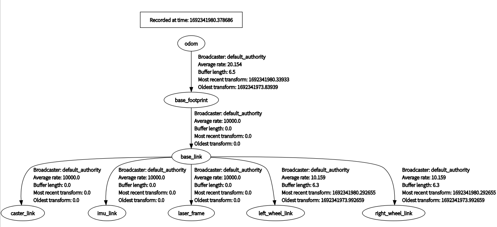

###### datetime:2023/11/08 16:27

###### author:nzb

> 该项目来源于[大佬的动手学ROS2](https://fishros.com/d2lros2)

# 4.建图前准备3-准备URDF

关于URDF在第八章我们已经介绍了，接下来我们直接使用它来编写URDF。

## 一、新建功能包

在 `fishbot/src` 目录下创建一个新的功能包，命名为 `fishbot_description`：

```
cd ~/fishbot_ws/src
ros2 pkg create --build-type ament_python fishbot_description
```

## 二、编写URDF

在 src/fishbot_description/ 目录下新建 urdf 文件夹，然后新建 fishbot_v1.0.0.urdf 文件 ，编写如下内容：

```
<?xml version="1.0"?>
<robot name="fishbot">
    
    <!-- Robot Footprint -->
  <link name="base_footprint"/>

  <joint name="base_joint" type="fixed">
    <parent link="base_footprint"/>
    <child link="base_link"/>
    <origin xyz="0.0 0.0 0.076" rpy="0 0 0"/>
  </joint>


  <!-- base link -->
  <link name="base_link">
  	<visual>
      <origin xyz="0 0 0.0" rpy="0 0 0"/>
      <geometry>
		<cylinder length="0.12" radius="0.10"/>
      </geometry>
      <material name="blue">
      	<color rgba="0.1 0.1 1.0 0.5" /> 
      </material>
    </visual>
  </link>
    
  <!-- laser link -->
  <link name="laser_frame">
  	<visual>
      <origin xyz="0 0 0" rpy="0 0 0"/>
      <geometry>
		<cylinder length="0.02" radius="0.02"/>
      </geometry>
      <material name="black">
      	<color rgba="0.0 0.0 0.0 0.5" /> 
      </material>
    </visual>
  </link>
    
  <!-- laser joint -->
  <joint name="laser_joint" type="fixed">
      <parent link="base_link" />
      <child link="laser_frame" />
      <origin xyz="0 0 0.075" />
  </joint>

  <link name="imu_link">
  	<visual>
      <origin xyz="0 0 0.0" rpy="0 0 0"/>
      <geometry>
		    <box size="0.02 0.02 0.02"/>
      </geometry>
    </visual>
  </link>

  <!-- imu joint -->
  <joint name="imu_joint" type="fixed">
      <parent link="base_link" />
      <child link="imu_link" />
      <origin xyz="0 0 0.02" />
  </joint>


  <link name="left_wheel_link">
      <visual>
        <origin xyz="0 0 0" rpy="1.57079 0 0"/>
        <geometry>
          <cylinder length="0.04" radius="0.032"/>
        </geometry>
          <material name="black">
            <color rgba="0.0 0.0 0.0 0.5" /> 
          </material>
      </visual>
  </link>
    
  <joint name="left_wheel_joint" type="continuous">
      <parent link="base_link" />
      <child link="left_wheel_link" />
      <origin xyz="-0.02 0.10 -0.06" />
      <axis xyz="0 1 0" />
  </joint>

  <link name="right_wheel_link">
      <visual>
        <origin xyz="0 0 0" rpy="1.57079 0 0"/>
        <geometry>
          <cylinder length="0.04" radius="0.032"/>
        </geometry>
          <material name="black">
            <color rgba="0.0 0.0 0.0 0.5" /> 
          </material>
      </visual>
  </link>
    
  <joint name="right_wheel_joint" type="continuous">
      <parent link="base_link" />
      <child link="right_wheel_link" />
      <origin xyz="-0.02 -0.10 -0.06" />
      <axis xyz="0 1 0" />
  </joint>

  <link name="caster_link">
    <visual>
      <origin xyz="0 0 0" rpy="1.57079 0 0"/>
      <geometry>
          <sphere radius="0.016"/>
      </geometry>
        <material name="black">
          <color rgba="0.0 0.0 0.0 0.5" /> 
        </material>
    </visual>
  </link>
    
  <joint name="caster_joint" type="fixed">
      <parent link="base_link" />
      <child link="caster_link" />
      <origin xyz="0.06 0.0 -0.076" />
      <axis xyz="0 1 0" />
  </joint>

</robot>
```

接着修改：src/fishbot_description/setup.py 文件 ，拷贝所有 URDF 到 Install 目录。

```
from setuptools import setup
from glob import glob
import os

package_name = 'fishbot_description'

setup(
    name=package_name,
    version='0.0.0',
    packages=[package_name],
    data_files=[
        ('share/ament_index/resource_index/packages',
            ['resource/' + package_name]),
        ('share/' + package_name, ['package.xml']),
        (os.path.join('share', package_name, 'launch'), glob('launch/*.launch.py')),
        (os.path.join('share', package_name, 'urdf'), glob('urdf/**')),
    ],
    install_requires=['setuptools'],
    zip_safe=True,
    maintainer='root',
    maintainer_email='root@todo.todo',
    description='TODO: Package description',
    license='TODO: License declaration',
    tests_require=['pytest'],
    entry_points={
        'console_scripts': [
            "rotate_wheel= fishbot_description.rotate_wheel:main"
        ],
    },
)

```

## 三、编写Launch文件

在 fishbot_bringup 下新建 launch 文件夹，然后新建 fishbot_bringup.launch.py，接着编写如下内容：

```
import os
from launch import LaunchDescription
from launch.substitutions import LaunchConfiguration
from launch_ros.actions import Node
from launch_ros.substitutions import FindPackageShare


def generate_launch_description():
    package_name = 'fishbot_description'
    urdf_name = "fishbot_v1.0.0.urdf"

    ld = LaunchDescription()
    pkg_share = FindPackageShare(package=package_name).find(package_name)
    urdf_model_path = os.path.join(pkg_share, f'urdf/{urdf_name}')

    robot_state_publisher_node = Node(
        package='robot_state_publisher',
        executable='robot_state_publisher',
        arguments=[urdf_model_path]
    )

    joint_state_publisher_node = Node(
        package='joint_state_publisher',
        executable='joint_state_publisher',
        name='joint_state_publisher',
        arguments=[urdf_model_path],
        output='screen',
    )

    fishbot_bringup_node = Node(
        package='fishbot_bringup',
        executable='fishbot_bringup',
        name='fishbot_bringup',
        output='screen',
    )

    ld.add_action(joint_state_publisher_node)
    ld.add_action(robot_state_publisher_node)
    ld.add_action(fishbot_bringup_node)

    return ld

```

接着修改：src/fishbot_bringup/CMakeLists.txt

添加拷贝 launch 指令

```
install(
  DIRECTORY launch  
  DESTINATION share/${PROJECT_NAME}
)
```

## 四 、编译运行测试

```
colcon build
source install/setup.bash
ros2 launch fishbot_bringup fishbot_bringup.launch.py
```

接着测试查看 TF

```
ros2 run rqt_tf_tree rqt_tf_tree
```

最终得到下图



## 五、总结

有了这样一个TF结构，我们的建图前的准备工作就差不多了。