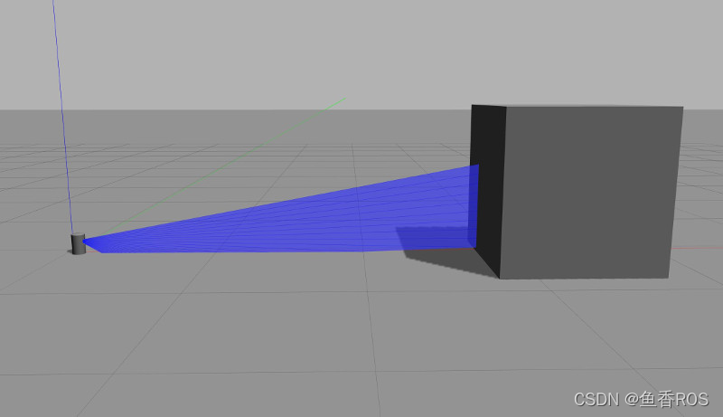
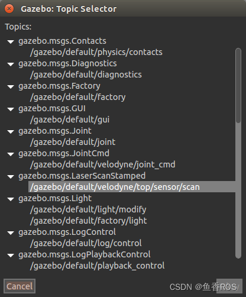
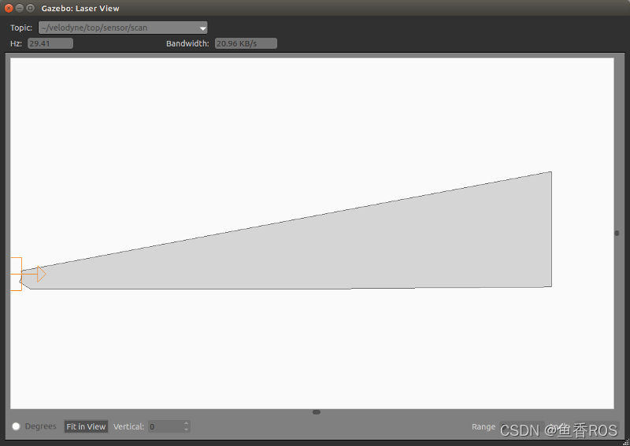
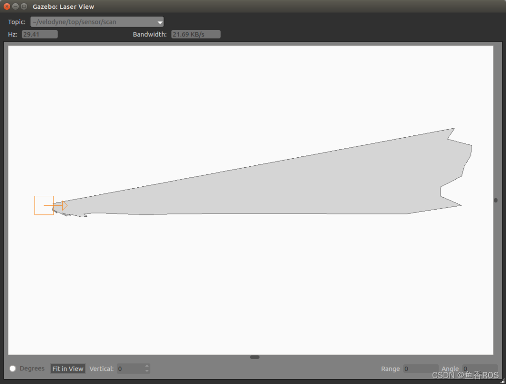
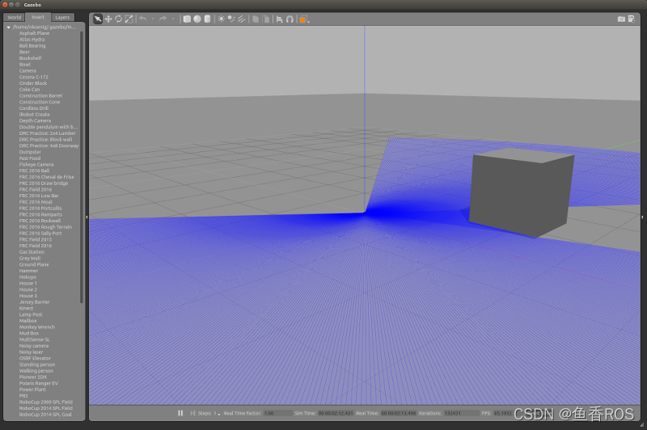
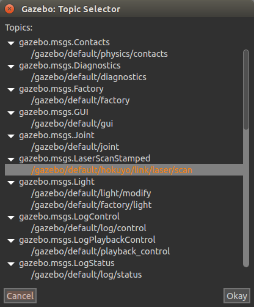
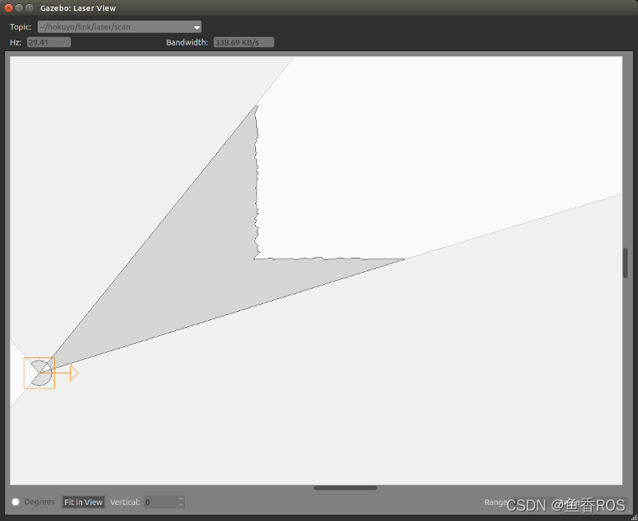
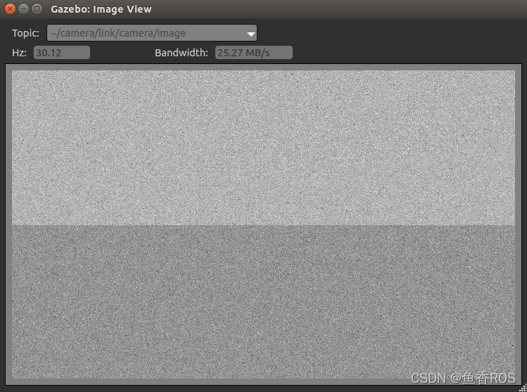

###### datetime:2023/10/07 10:21

###### author:nzb

> 该项目来源于[大佬的动手学ROS2](https://fishros.com/d2lros2)

# Gazebo仿真进阶教程之传感器高斯噪声

## 传感器噪声

每一个或几乎每个传感器的输出中都有噪声。相机可能有色差、声纳有多路径效应和激光会有不正确的距离读数。我们必须在仿真的传感器中添加噪声，以使得仿真的传感器和真实传感器产生的数据更加接近。

Gazebo 有一个内置的噪声模型，可以应用高斯噪声到各种传感器。虽然高斯噪声可能不是非常现实，它总比没有好，并作为一个很好的第一阶近似噪声。高斯噪声也比较容易应用于数据流。

### 第 1 步：可视化传感器数据

让我们从查看当前的 Velodyne 输出开始，然后我们可以添加噪声。

#### 打开 Gazebo，插入 Velodyne 传感器。

- gazebo

- 选择左上角附近的插入选项卡。

- 向下滚动并选择 Velodyne HDL-32 型号。

- 单击渲染窗口中的某个位置。

#### 在激光束前面添加一个 Box，这样我们就可以得到有用的数据。

- 选择渲染窗口上方工具栏中的 Box 图标。

- 在激光束前左键单击以放置盒子。



#### 我们可以通过 Gazebo 的主题可视化器仔细查看传感器数据。

- 按 Ctrl-t，打开主题选择器。找话题。`/gazebo/default/velodyne/top/sensor/scan`



- 选择主题，然后按确定打开激光可视化器。`/gazebo/default/velodyne/top/sensor/scan`



请注意输出的流畅线条。

### 第 2 步：向传感器添加噪声

可以使用标签访问 Gazebo 的噪声模型。有关更多信息，请参见 sdformat.org/spec。

打开 Velodyne 模型。

```shell
gedit ~/.gazebo/models/velodyne_hdl32/model.sdf

```

添加一个元素作为元素的子元素。我们将首先应用大量的噪点，这样效果就很容易看到了。

```xml

<sensor type="ray" name="sensor">
    <pose>0 0 -0.004645 1.5707 0 0</pose>
    <visualize>true</visualize>
    <ray>
        <noise>
            <!-- Use gaussian noise -->
            <type>gaussian</type>
            <mean>0.0</mean>
            <stddev>0.1</stddev>
        </noise>
```

再次将 Velodyne 传感器添加到 Gazebo，并在横梁前插入一个盒子。 打开主题可视化工具 (Ctrl-t)，然后选择 Velodyne 激光扫描主题。输出应该看起来很嘈杂。



现在让我们将噪音降低到合理的程度。

```xml

<sensor type="ray" name="sensor">
    <pose>0 0 -0.004645 1.5707 0 0</pose>
    <visualize>true</visualize>
    <ray>
        <noise>
            <!-- Use gaussian noise -->
            <type>gaussian</type>
            <mean>0.0</mean>
            <stddev>0.02</stddev>
        </noise>
```

## 常见传感器的噪声

### 介绍

Gazebo提供了很多常见传感器的模型，在真实的世界，传感器都会产生噪声，因为现实中的传感器并不能完美的观察这个世界。但是在默认的情况下，Gazebo的传感器可以完美的观察仿真世界，为了让仿真更加的真实，我们会在Gazebo的传感器中添加一些噪声到Gazebo传感器生成的数据中。

Gazebo目前可以给下面几个类型的传感器添加噪声:

- 射线类（Ray） (例如, 雷达)

- 相机（Camera）

- 惯性测量单元（IMU）

接下来带你一一介绍。

### 射线类-Ray（雷达）噪声

对于射线传感器，我们将高斯噪声加入到每个波束的范围中。你可以设置平均值和标准差正态分布，从中噪声值将被采样。噪声值为每个波束独立采样。在添加噪声后，产生的范围被限制在传感器的最小和最大范围(包括在内)之间。

测试传感器噪声模型：

- 创建模型目录

```shell
mkdir -p ~/.gazebo/models/noisy_laser
```

- 创建模型配置文件

```shell
gedit ~/.gazebo/models/noisy_laser/model.config
```

- 复制粘贴下面的代码到配置文件

```xml
<?xml version="1.0"?>
<model>
    <name>Noisy laser</name>
    <version>1.0</version>
    <sdf version='1.6'>model.sdf</sdf>

    <author>
        <name>My Name</name>
        <email>me@my.email</email>
    </author>

    <description>
        My noisy laser.
    </description>
</model>
```

- 创建一个文件 `~/.gazebo/models/noisy_laser/model.sdf`

```shell
gedit ~/.gazebo/models/noisy_laser/model.sdf
```

- 粘贴以下内容，这是添加了噪声的标准 Hokuyo 模型的代码：

```xml
<?xml version="1.0" ?>
<sdf version="1.6">
    <model name="hokuyo">
        <link name="link">
            <gravity>false</gravity>
            <inertial>
                <mass>0.1</mass>
            </inertial>
            <visual name="visual">
                <geometry>
                    <mesh>
                        <uri>model://hokuyo/meshes/hokuyo.dae</uri>
                    </mesh>
                </geometry>
            </visual>
            <sensor name="laser" type="ray">
                <pose>0.01 0 0.03 0 -0 0</pose>
                <ray>
                    <scan>
                        <horizontal>
                            <samples>640</samples>
                            <resolution>1</resolution>
                            <min_angle>-2.26889</min_angle>
                            <max_angle>2.268899</max_angle>
                        </horizontal>
                    </scan>
                    <range>
                        <min>0.08</min>
                        <max>10</max>
                        <resolution>0.01</resolution>
                    </range>
                    <noise>
                        <type>gaussian</type>
                        <mean>0.0</mean>
                        <stddev>0.01</stddev>
                    </noise>
                </ray>
                <plugin name="laser" filename="libRayPlugin.so"/>
                <always_on>1</always_on>
                <update_rate>30</update_rate>
                <visualize>true</visualize>
            </sensor>
        </link>
    </model>
</sdf>
```

- 启动Gazebo：

```shell
gazebo
```

- 插入嘈杂的激光：在左侧窗格中，选择Insert选项卡，然后单击。将您的激光器放在世界某处，并在其前面放置一个盒子。Noisy laser



- 可视化嘈杂的激光：单击窗口->主题可视化（或按 Ctrl-T）以调出主题选择器。



- 找到名称为 like 的主题并单击它，然后单击。您将获得一个显示激光数据的激光视图窗口。`/gazebo/default/hokuyo/link/laser/scan` Okay



如您所见，扫描噪声很大。要调整噪声，只需调整其中的平均值和标准偏差值，其中单位是米：

- `model.sdf`

```xml

<noise>
    <type>gaussian</type>
    <mean>0.0</mean>
    <stddev>0.01</stddev>
</noise>
```

这些是Hokuyo激光的合理值。

### 相机噪音

对于相机传感器，我们对输出放大器噪声进行建模，它为每个像素独立添加高斯采样干扰。您可以设置从中采样噪声值的高斯分布的均值和标准差。为每个像素独立采样一个噪声值，然后将该噪声值独立添加到该像素的每个颜色通道。添加噪声后，生成的颜色通道值被限制在
0.0 和 1.0 之间；这个浮点颜色值最终会在图像中作为一个无符号整数，通常在 0 到 255 之间（每个通道使用 8 位）。

此噪声模型在GLSL着色器中实现，需要 GPU 才能运行。

测试相机噪声模型：

- 创建模型目录：

```shell
mkdir -p ~/.gazebo/models/noisy_camera
```

- 创建模型配置文件：

```shell
gedit ~/.gazebo/models/noisy_camera/model.config
```

- 粘贴以下内容：

```xml
<?xml version="1.0"?>
<model>
    <name>Noisy camera</name>
    <version>1.0</version>
    <sdf version='1.6'>model.sdf</sdf>

    <author>
        <name>My Name</name>
        <email>me@my.email</email>
    </author>

    <description>
        My noisy camera.
    </description>
</model>
```

- 创建一个文件。`~/.gazebo/models/noisy_camera/model.sdf`

```shell
gedit ~/.gazebo/models/noisy_camera/model.sdf
```

- 粘贴以下内容，这是添加了噪点的标准相机模型的副本：

```xml
<?xml version="1.0" ?>
<sdf version="1.6">
    <model name="camera">
        <link name="link">
            <gravity>false</gravity>
            <pose>0.05 0.05 0.05 0 0 0</pose>
            <inertial>
                <mass>0.1</mass>
            </inertial>
            <visual name="visual">
                <geometry>
                    <box>
                        <size>0.1 0.1 0.1</size>
                    </box>
                </geometry>
            </visual>
            <sensor name="camera" type="camera">
                <camera>
                    <horizontal_fov>1.047</horizontal_fov>
                    <image>
                        <width>1024</width>
                        <height>1024</height>
                    </image>
                    <clip>
                        <near>0.1</near>
                        <far>100</far>
                    </clip>
                    <noise>
                        <type>gaussian</type>
                        <mean>0.0</mean>
                        <stddev>0.07</stddev>
                    </noise>
                </camera>
                <always_on>1</always_on>
                <update_rate>30</update_rate>
                <visualize>true</visualize>
            </sensor>
        </link>
    </model>
</sdf>
```

- 启动Gazebo：

```shell
gazebo
```

- 插入嘈杂的摄像头：在左侧窗格中，选择`Insert`选项卡，然后单击。把你的相机放在世界的某个地方。`Noisy camera`

- 可视化嘈杂的摄像机：单击 `Window->Topic Visualization`（或按 `Ctrl-T`）以调出 `Topic Selector`。

- 找到名称为 like 的主题并单击它，然后单击。您将获得一个显示图像数据的图像视图窗口。`/gazebo/default/camera/link/camera/image Okay`



如果您仔细观察，您会发现图像有噪点。要调整噪声，只需调整这些是无单位的值；噪声将被添加到 `[0.0,1.0]` 范围内的每个颜色通道。 `model.sdf`

上面的例子`<stddev>`很高，我们尝试减少这个值：

```xml

<noise>
    <type>gaussian</type>
    <mean>0.0</mean>
    <stddev>0.007</stddev>
</noise>
```

这些对于像样的数码相机来说是合理的值。

### IMU 噪声

对于 IMU 传感器，我们对角速率和线性加速度的两种干扰进行建模：噪声和偏差。分别考虑角速率和线性加速度，导致该模型有 4 组参数：速率噪声、速率偏差、加速度噪声和加速度偏差。没有对 IMU
的方向数据应用噪声，该数据被提取为世界框架中的完美值（这在未来应该会改变）。

噪音是可加性的，从正态分布中取样。你可以设置高斯分布的平均值和标准差(一个用于比率，一个用于加速度) ，从中将采样噪声值。噪声值为每个样本的每个组件(x，y，z)独立采样，并添加到该组件中。

偏差也是附加的，但是只在模拟开始的时候会被取样一次。你可以设置高斯分布的平均值和标准差(一个用于比率，一个用于加速度) ，从中可以采样到偏差值。偏差将根据提供的参数进行取样，然后以等概率否定;
假设所提供的平均值表示偏差的大小，并且在两个方向上都可能存在偏差。此后，偏差是一个固定值，添加到每个样品的每个组分(x，y，z)。

**注意：** 根据被模拟的系统和物理引擎的配置，模拟的 IMU 数据可能已经很嘈杂，因为系统没有一直被求解到收敛。因此，根据您的应用程序，可能不需要添加噪声。

测试 IMU 噪声模型：

- 创建模型目录：

```shell
mkdir -p ~/.gazebo/models/noisy_imu
```

- 创建模型配置文件：

```shell
gedit ~/.gazebo/models/noisy_imu/model.config
```

- 粘贴以下内容：

```xml
<?xml version="1.0"?>
<model>
    <name>Noisy IMU</name>
    <version>1.0</version>
    <sdf version='1.6'>model.sdf</sdf>

    <author>
        <name>My Name</name>
        <email>me@my.email</email>
    </author>

    <description>
        My noisy IMU.
    </description>
</model>
```

- 创建`~/.gazebo/models/noisy_imu/model.sdf`文件

```shell
gedit ~/.gazebo/models/noisy_imu/model.sdf
```

- 粘贴以下内容：

```xml
<?xml version="1.0" ?>
<sdf version="1.6">
    <model name="imu">
        <link name="link">
            <inertial>
                <mass>0.1</mass>
            </inertial>
            <visual name="visual">
                <geometry>
                    <box>
                        <size>0.1 0.1 0.1</size>
                    </box>
                </geometry>
            </visual>
            <collision name="collision">
                <geometry>
                    <box>
                        <size>0.1 0.1 0.1</size>
                    </box>
                </geometry>
            </collision>
            <sensor name="imu" type="imu">
                <imu>
                    <angular_velocity>
                        <x>
                            <noise type="gaussian">
                                <mean>0.0</mean>
                                <stddev>2e-4</stddev>
                                <bias_mean>0.0000075</bias_mean>
                                <bias_stddev>0.0000008</bias_stddev>
                            </noise>
                        </x>
                        <y>
                            <noise type="gaussian">
                                <mean>0.0</mean>
                                <stddev>2e-4</stddev>
                                <bias_mean>0.0000075</bias_mean>
                                <bias_stddev>0.0000008</bias_stddev>
                            </noise>
                        </y>
                        <z>
                            <noise type="gaussian">
                                <mean>0.0</mean>
                                <stddev>2e-4</stddev>
                                <bias_mean>0.0000075</bias_mean>
                                <bias_stddev>0.0000008</bias_stddev>
                            </noise>
                        </z>
                    </angular_velocity>
                    <linear_acceleration>
                        <x>
                            <noise type="gaussian">
                                <mean>0.0</mean>
                                <stddev>1.7e-2</stddev>
                                <bias_mean>0.1</bias_mean>
                                <bias_stddev>0.001</bias_stddev>
                            </noise>
                        </x>
                        <y>
                            <noise type="gaussian">
                                <mean>0.0</mean>
                                <stddev>1.7e-2</stddev>
                                <bias_mean>0.1</bias_mean>
                                <bias_stddev>0.001</bias_stddev>
                            </noise>
                        </y>
                        <z>
                            <noise type="gaussian">
                                <mean>0.0</mean>
                                <stddev>1.7e-2</stddev>
                                <bias_mean>0.1</bias_mean>
                                <bias_stddev>0.001</bias_stddev>
                            </noise>
                        </z>
                    </linear_acceleration>
                </imu>
                <always_on>1</always_on>
                <update_rate>1000</update_rate>
            </sensor>
        </link>
    </model>
</sdf>
```

- 启动Gazebo：

```shell
gazebo
```

- 插入嘈杂的 `IMU`：在左侧窗格中，选择`Insert`选项卡，然后单击。将您的 `IMU` 放在世界的某个地方。`Noisy IMU`

- 可视化嘈杂的 `IMU`：单击 `Window->Topic Visualization`（或按` Ctrl-T`）调出 `Topic Selector`。

- 找到名称为 `like` 的主题并单击它，然后单击。您将获得一个显示 `IMU` 数据的文本视图窗口。`/gazebo/default/imu/link/imu/imu Okay`

在 `IMU` 等高速传感器上识别噪声可能很困难，尤其是在复杂系统中。您应该能够看到大的非零均值对噪声或偏差参数的影响。

要调整噪声，只需使用. 速率噪声和速率偏差的单位是 rad/s，加速度噪声和加速度偏差的单位是 `m/s^2`。

`model.sdf`

```xml

<angular_velocity>
    <x>
        <noise type="gaussian">
            <mean>0.0</mean>
            <stddev>2e-4</stddev>
            <bias_mean>0.0000075</bias_mean>
            <bias_stddev>0.0000008</bias_stddev>
        </noise>
    </x>
    <y>
        <noise type="gaussian">
            <mean>0.0</mean>
            <stddev>2e-4</stddev>
            <bias_mean>0.0000075</bias_mean>
            <bias_stddev>0.0000008</bias_stddev>
        </noise>
    </y>
    <z>
        <noise type="gaussian">
            <mean>0.0</mean>
            <stddev>2e-4</stddev>
            <bias_mean>0.0000075</bias_mean>
            <bias_stddev>0.0000008</bias_stddev>
        </noise>
    </z>
</angular_velocity>
<linear_acceleration>
<x>
    <noise type="gaussian">
        <mean>0.0</mean>
        <stddev>1.7e-2</stddev>
        <bias_mean>0.1</bias_mean>
        <bias_stddev>0.001</bias_stddev>
    </noise>
</x>
<y>
    <noise type="gaussian">
        <mean>0.0</mean>
        <stddev>1.7e-2</stddev>
        <bias_mean>0.1</bias_mean>
        <bias_stddev>0.001</bias_stddev>
    </noise>
</y>
<z>
    <noise type="gaussian">
        <mean>0.0</mean>
        <stddev>1.7e-2</stddev>
        <bias_mean>0.1</bias_mean>
        <bias_stddev>0.001</bias_stddev>
    </noise>
</z>
</linear_acceleration>
```

上面是一个高质量IMU的合理噪声配置值。


