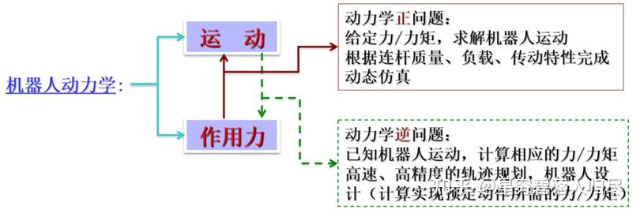
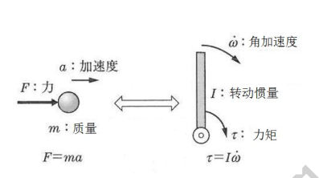
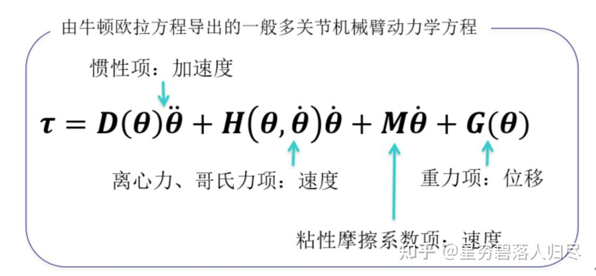
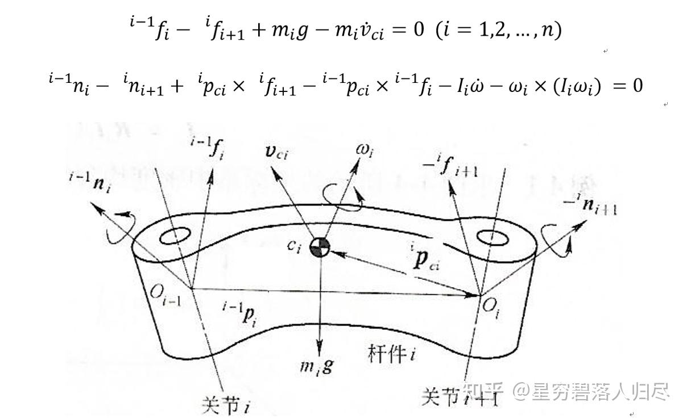
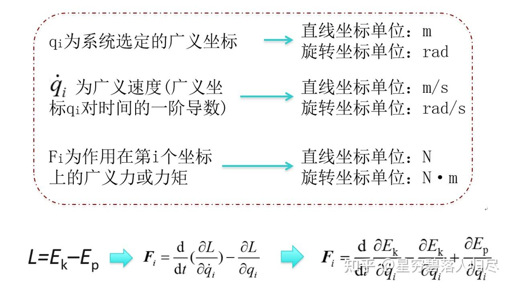
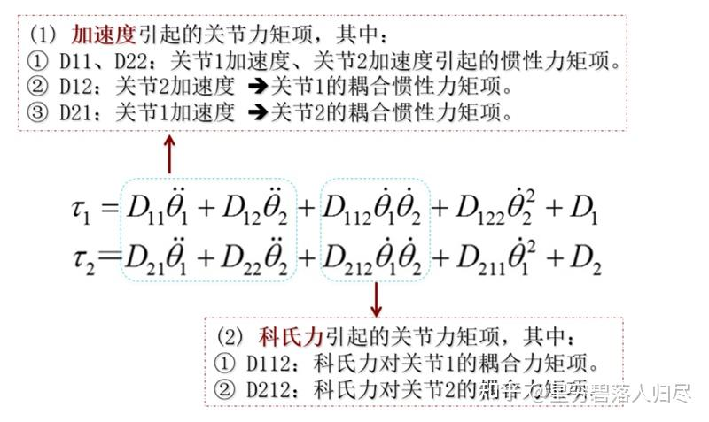
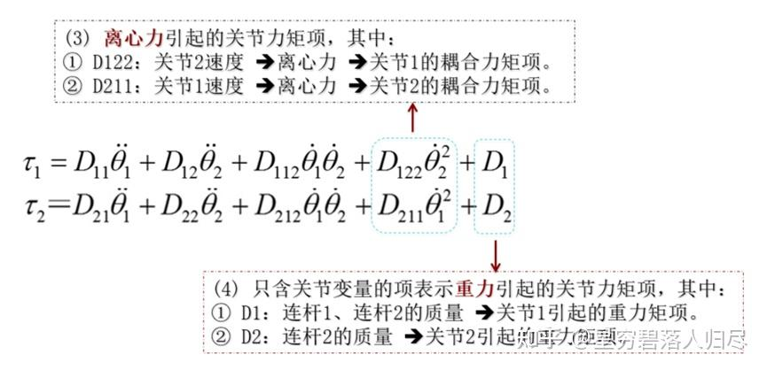
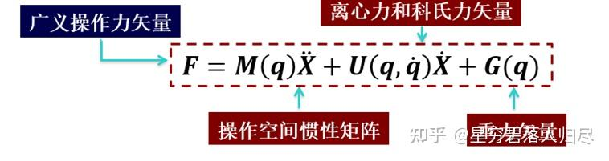
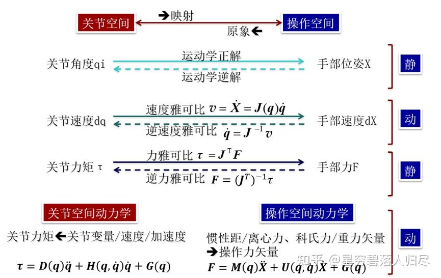

###### datetime:2025/09/04 16:16

###### author:nzb

# 机器人基础知识学习笔记—理论篇

## 4. 机器人动力学

机器人在工作状态下，把持物体或与外部环境之间相互作用，需要机器人关节提供力和力矩，通过连杆传递到末端操作器，达到静态平衡和产生运动。

机器人动力学与一般结构动力学相比，是一个具有**多输入**和**多输出**的复杂的动力学系统，存在严重的**非线性**，是主动的机械装置，研究和控制该系统必须建立其动力学模型，即动力学方程。

### 机器人动力学研究的主要方法

1. 牛顿-欧拉(Newton-Euler) 法：
    - 从运动学出发应用牛顿方程求加速度，消去内力得到动力学方程，计算速度高，便于实时控制，但结构复杂。

2. 拉格朗日(Langrange)法：
    - 可以用最简单的形式求解较为复杂的系统动力学方程，只需要速度，具有显式结构。

3. 其他：高斯(Gauss)法、凯恩(Kane)法及罗伯逊-魏登堡(Roberon-Wittenburg) 法等。

### 4.1 牛顿-欧拉法

**牛顿-欧拉方程：** 通过递推关系建立递归方程，得出表示关节位移与关节力关系的动力学方程，由基座标 $$\tau \Rightarrow$$ 关节 $$1 \Rightarrow$$ 关节 $$2 \cdots \Rightarrow$$ 关节 n，得到

$$\tau = f(\dot{\theta}, \ddot{\theta}, \theta)$$

#### 4.1.1 应用牛顿-欧拉法建立动力学方程

- a. 研究构件质心的运动使用牛顿方程

质量为 m、质心在 C 点的刚体，作用在其质心的力 F 的大小与质心加速度 $$a_{c}$$ 的关系为

$$F = ma_c$$

- b. 研究相对于构件质心的转动使用欧拉方程

刚体以角速度 $$\omega$$，角加速度 $$\dot{\omega}$$ 的转动，则作用在刚体上力矩 $$\tau$$ 的大小为

$$\tau = I_c \dot{\omega} + \omega \times I_c \omega$$

其中，$$I_c$$ 为刚体相对于原点通过质心 C 并与刚体固结的刚体坐标系的**惯性张量**。可以看出，牛顿-欧拉法表征了力、力矩、惯性张量和加速度之间的关系。

#### 4.1.2 牛顿-欧拉法的应用

以平面关节型机器人手臂为例，其连杆绕固定轴 Z 轴转动，转动惯量 I 为

|  | linear | angular |
| --- | --- | --- |
| 惯性 | 质量 $$m$$ | 张量 $$I$$ |
| 动量 | $$m v$$ | $$l \omega$$ |
| 外力 | 力 $$F$$ | 力矩 $$\tau$$ |
| 加速度 | 线性加速度 $$a$$ | 角加速度 $$\alpha$$ |
| 欧拉方程 | $$F=m a$$ | $$\tau=l \alpha+\omega \times l \omega$$ |

$$\tau=I_{c} \dot{\omega}+\omega \times I_{c} \omega=I_{c} \dot{\omega}$$

$$I_{c} \dot{\omega}=\left[\begin{array}{l}0 \\0 \\I \ddot{\theta}\end{array}\right]$$

$$\omega \times I_{c} \omega=\left[\begin{array}{l}0 \\0 \\ \dot{\theta}\end{array}\right] \times\left[\begin{array}{l}0 \\0 \\I \dot{\theta}\end{array}\right]=\left[\begin{array}{l}0 \\0 \\0\end{array}\right]$$

牛顿欧拉法是由平移运动的牛顿方程式和回转运动的欧拉方程式构成。分别按照构成机械臂的每一个关节建立力、力矩在平衡转态下的动力学方程式,再将它们联立后得到机器人手臂全体的动力学方程式。

牛顿-欧拉法求解的一般动力学方程

质心速度: $$v_{ci}$$

角速度: $$\omega_{i}$$

惯性力: $$m \dot{v}_{c i}$$

惯性力矩: $$\omega \times I_{i} \omega + I_{i} \dot{\omega}$$

$$i$$ 杆绕质心的惯性张量: $$I_{i}$$

$$\begin{aligned}& { }^{i-1} f_{i}-{ }^{i} f_{i+1}+m_{i} g-m_{i} \dot{v}_{c i}=0 \quad(i=1,2, \ldots, n) \\& { }^{i-1} n_{i}-{ }^{i} n_{i+1}+{ }^{i} p_{c i} \times{ }^{i} f_{i+1}-{ }^{i-1} p_{c i} \times{ }^{i-1} f_{i}-\omega_{i} \dot{\omega}_{i}-\omega_{i} \times\left(I_{i} \omega_{i}\right)=0\end{aligned}$$

### 4.2 拉格朗日方程

在机器人的动力学研究中，主要应用拉格朗日方程建立机器人的动力学方程。这类方程可直接表示为系统控制输入的函数，若采用齐次坐标，逆推的拉格朗日方程可建立比较方便而有效的动力学方程。

对于任何机械系统，拉格朗日函数 L 定义为系统总动能 $$E_{k}$$ 与总势能 $$E_{p}$$ 之差。

$$L = E_{k} - E_{p}$$

其中:

$$E_{k}=\frac{1}{2} m v^{2}+\frac{1}{2} I \omega^{2}$$

$$E_{p}=m g h$$

$$L=E_{k}-E_{p}=\frac{1}{2} m v^{2}+\frac{1}{2} I \omega^{2}-m g h$$

由拉格朗日函数 L 所描述的系统动力学状态的拉格朗日方程（简称 L-E 方程，$$E_{k}$$ 和 $$E_{p}$$ 可以用任何方便的坐标系来表示），其中：质量为 $$m$$，速度 $$v$$，转动惯量 $$I$$，角速度 $$\omega$$，高度 $$h$$。

作用在第 $$i$$ 个坐标上的广义力为

$$F_{i}=\frac{\mathrm{d}}{\mathrm{d} t}\left(\frac{\partial L}{\partial \dot{q}_{i}}\right)-\frac{\partial L}{\partial q_{i}}$$

L: 为拉格朗日函数(又称拉格朗日算子); i=1,2...n; n: 为连杆数目

$$L=E_{k}-E_{p} \quad F_{i}=\frac{\mathrm{d}}{\mathrm{d} t}\left(\frac{\partial L}{\partial \dot{q}_{i}}\right)-\frac{\partial L}{\partial q_{i}} \quad F_{i}=\frac{\mathrm{d}}{\mathrm{d} t} \frac{\partial E_{k}}{\partial \dot{q}_{i}}-\frac{\partial E_{k}}{\partial \dot{q}_{i}}+\frac{\partial E_{p}}{\partial q_{i}}$$

(1) 系统的势能 $$E_{p}$$ 仅是广义坐标 $$q_{i}$$ 的函数，而动能 $$E_{k}$$ 是 $$q_{i}$$、$$\dot{q}_{i}$$ 及时间 $$t$$ 的函数，因此拉格朗日函数可以写成 $$L=L(q_{i}, \dot{q}_{i}, t)$$。

(2) 若 $$q_{i}$$ 是线位移，则 $$\dot{q}_{i}$$ 是线速度，对应的广义力 $$F_{i}$$ 就是力；若 $$q_{i}$$ 是角位移，则 $$\dot{q}_{i}$$ 是角速度，对应的广义力 $$F_{i}$$ 是力矩。

**机器人动态控制**：给出已知的轨迹点上的 $$\theta, \dot{\theta}, \ddot{\theta}$$，即机器人关节位置、速度、加速度，求解相应的关节力矩向量 $$\tau$$。

**机器人运动仿真**：已知关节力矩向量 $$\tau$$，求机器人系统产生的相应的运动，即机器人关节位置、速度、加速度 $$\theta, \dot{\theta}, \ddot{\theta}$$。

### 4.3 机器人动力学方程推导

不过，当需要面对非线性的复杂动力学系统，动力学问题的求解比较困难，运算时间长，所以需要简化解的过程，最大限度地减少机器人动力学在线计算的时间。

机器人是结构复杂的连杆系统，一般采用齐次变换的方法，用拉格朗日方程建立其系统动力学方程，对其位姿和运动状态进行描述。

机器人动力学方程的具体推导过程：

(1) 选取坐标系，选定完全而且独立的广义关节变量 $$q_{i}$$，i=1, 2,..., n;

(2) 选定相应关节上的广义力 $$F_{i}$$：当 $$q_{i}$$ 是位移变量时，$$F_{i}$$ 为力；当 $$q_{i}$$ 是角度变量时，$$F_{i}$$ 为力矩；

(3) 求出机器人各构件的动能和势能，构造拉格朗日函数；

(4) 代入拉格朗日方程求得机器人系统的动力学方程。

$$\begin{aligned} \tau_{1} &= D_{11} \ddot{\theta}_{1} + D_{12} \ddot{\theta}_{2} + D_{112} \dot{\theta}_{1} \dot{\theta}_{2} + D_{122} \dot{\theta}_{2}^{2} + D_{1} \\ \tau_{2} &= D_{21} \ddot{\theta}_{1} + D_{22} \ddot{\theta}_{2} + D_{212} \dot{\theta}_{1} \dot{\theta}_{2} + D_{211} \dot{\theta}_{1}^{2} + D_{2} \end{aligned}$$

(1) 加速度引起的关节力矩项，其中：

- ① D11、D22：关节1加速度、关节2加速度引起的惯性力矩项。
- ② D12：关节2加速度 $$\Rightarrow$$ 关节1的耦合惯性力矩项。
- ③ D21：关节1加速度 $$\Rightarrow$$ 关节2的耦合惯性力矩项。

(2) 科氏力引起的关节力矩项，其中：
- ① D112：科氏力对关节1的耦合力矩项。
- ② D212：科氏力对关节2的耦合力矩项。

(3) 离心力引起的关节力矩项，其中：
- ① D122：关节2速度 $$\Rightarrow$$ 离心力 $$\Rightarrow$$ 关节1的耦合力矩项。
- ② D211：关节1速度 $$\Rightarrow$$ 离心力 $$\Rightarrow$$ 关节2的耦合力矩项。

(4) 只含关节变量的项表示重力引起的关节力矩项，其中：
- ① D1：连杆1、连杆2的质量 $$\Rightarrow$$ 关节1引起的重力矩项。
- ② D2：连杆2的质量 $$\Rightarrow$$ 关节2引起的重力矩项。

对于比较复杂的多自由度机器人，其动力学方程更庞杂，推导过程更为复杂，不利于机器人的实时控制。进行动力学分析时，通常进行下列简化：
- (1) 当杆件长度不太长，重量很轻时，动力学方程中的重力矩项可以省略。
- (2) 当关节速度不太大，机器人不是高速机器人时，速度项、科氏力项可以省略。
- (3) 当关节加速度不太大，即关节电动机的升、降速比较平稳时，加速度项有时可以省略。但关节加速度减小会引起速度升降的时间增加，延长机器人作业循环的时间。

### 4.4 机器人关节空间和操作空间动力学分析

### 4.4.1 关节空间的动力学方程

操作臂在关节空间的动力学方程的一般结构形式，它反映了关节力矩与关节变量、速度、加速度之间的函数关系

$$\boldsymbol{\tau} = \boldsymbol{D}(q)\ddot{q} + \boldsymbol{H}(q,\dot{q})\dot{q} + \boldsymbol{G}(q)$$

其中，

$$\boldsymbol{\tau}=\left[\begin{array}{l}\tau_{1} \\\tau_{2}\end{array}\right] \quad \ddot{q}=\left[\begin{array}{l}\ddot{\theta}_{1} \\\ddot{\theta}_{2}\end{array}\right] \quad \dot{q}=\left[\begin{array}{l}\dot{\theta}_{1} \\\dot{\theta}_{2}\end{array}\right] \quad q=\left[\begin{array}{l}\theta_{1} \\\theta_{2}\end{array}\right]$$

$$\boldsymbol{D}(q)=\left[\begin{array}{cc}m_{1} p_{1}^{2}+m_{2}\left(l_{1}^{2}+p_{2}^{2}+2 l_{1} p_{2} c \theta_{2}\right) & m_{2}\left(p_{2}^{2}+l_{1} p_{2} c \theta_{2}\right) \\m_{2}\left(p_{2}^{2}+l_{1} p_{2} c \theta_{2}\right) & m_{2} p_{2}^{2}\end{array}\right]$$

$$\boldsymbol{H}(q, \dot{q})=\left[\begin{array}{c}-m_{2} l_{1} p_{2} s \theta_{2} \dot{\theta}_{2}^{2}-2 m_{2} l_{1} p_{2} s \theta_{2} \dot{\theta}_{1} \dot{\theta}_{2} \\m_{2} l_{1} p_{2} s \theta_{2} \dot{\theta}_{1}^{2}\end{array}\right]$$

$$\boldsymbol{G}(q)=\left[\begin{array}{c}\left(m_{1} p_{1}+m_{2} l_{1}\right) g s \theta_{1}+m_{2} p_{2} g s_{12} \\m_{2} p_{2} g s_{12}\end{array}\right]$$

其中，对于 n 关节机器人：

- D(q):n×n 矩阵，q 的函数，惯性矩阵
- H(q,q'):n×1 离心力和科氏力矩阵
- G(q):n×1 重力矢量

### 4.4.2 操作空间动力学方程

与关节空间动力学方程相对应，在笛卡儿操作空间中可以用直角坐标变量即末端操作器位姿的矢量 X 表示机器人动力学方程。因此，操作力 F 与末端加速度之间的关系可表示为

关节空间动力学方程和操作空间动力学方程之间的对应关系可以通过广义操作力 F 与广义关节力 τ 之间的关系，

$$\boldsymbol{\tau}=\boldsymbol{J}^{\mathrm{T}}(q) \boldsymbol{F}$$

操作空间与关节空间之间的速度、加速度的关系式

$$\left.\begin{array}{l} \dot{X}=J(q) \dot{q} \\ \ddot{X}=J(q) \ddot{q}+\dot{J}(q) \dot{q} \end{array}\right\}$$

### 4.4.3 关节空间和操作空间

#### 关节空间

n 个自由度操作臂的末端位姿 X 由 n 个关节变量所决定，这 n 个关节变量也叫做 n 维关节矢量 q，所有关节矢量 q 构成了关节空间。

#### 操作空间

末端执行器的作业是在直角坐标空间中进行的，即操作臂末端位姿 X 是在直角坐标空间中描述的。

| 关节空间 | 操作空间 |
| --- | --- |
| 角度 | 位姿 |
| 关节速度 | 手部速度 |
| 关节力矩 | 手部力 |
| 关节空间动力学 | 操作空间动力学 |

#### 关节空间动力学

关节力矩 $$\Leftarrow$$ 关节变量/速度/加速度

$$\tau = D(q) \ddot{q} + H(q, \dot{q}) \dot{q} + G(q)$$

#### 操作空间动力学

惯性距/离心力、科氏力/重力矢量 $$\Rightarrow$$ 操作力矢量

$$F = M(q) \ddot{X} + U(q, \dot{q}) \dot{X} + G(q)$$

### 4.4.4 科氏力

科氏力是对旋转体系中进行直线运动的质点由于惯性相对于旋转体产生的直线移动的偏离的一种描述，科氏力来自与物体运动所具有的惯性。

当一个质点相对于惯性系做直线运动时，相对于旋转体系，其轨迹是一条曲线。立足于旋转体系，我们认为有一个力的作用使质点的运动轨迹形成曲线。这个力就是科氏力。

在旋转体系中进行直线运动的质点，由于惯性，有沿着原有运动方向继续运动的趋势，以旋转体系的视角观察就会发生一定程度的偏离。
