###### datetime:2025/09/04 16:16

###### author:nzb

# 机器人基础知识学习笔记—理论篇

## 5. 机器人控制和运动规划

### 5.1 控制与规划方式

工业机器人控制方式有不同的分类，如按被控对象可分为**位置控制、速度控制、加速度控制、力控制、力矩控制、力和位置混合控制**等，其中位置控制是机器人的最基本的控制任务。机器人的很多作业是控制机器人末端工具的位置和姿态，以实现点到点的控制（如搬运、点焊机器人）或连续路径控制（如弧焊、喷漆机器人），因此实现机器人的位置控制是机器人的基本控制任务，它也称为位姿控制或轨迹控制。

这里，路径和轨迹存在很多方面的差别，区别如下：

(1) 定义与本质

路径：路径通常指的是物体在空间中实际经过的路线，它包含了物体从起点到终点所经过的所有点。路径可以是任意的，包括曲线、折线、闪烁等不同的形式，是物体实际运动的具体表现。

轨迹：轨迹则是对路径的抽象描述，通常是一个几何形状或方程。它表示物体在空间中按照一定规律运动的路线，但不一定包含物体运动过程中的所有细节。轨迹可以是固定的，如直线、圆弧、椭圆等几何形状，用于理论分析和建模。

(2) 运动方式与物理意义

运动方式：路径的运动方式可以是任意的，取决于物体的实际运动情况。而轨迹则通常是固定的，它描述的是物体在特定条件下的运动规律。

物理意义：路径包含了物体在空间中的位置坐标、速度和加速度等信息，是物体实际运动的具体记录。轨迹则更多地关注于物体的运动规律、轨迹方程等理论层面的内容。

(3) 时间性质与表示方式

时间性质：路径通常是随时间连续变化的，可以描述物体的整个运动过程。而轨迹一般是一个静态的几何形状或方程，不涉及时间的变化。

表示方式：路径可以通过实物、图像、数学方程等多种方式进行表示，以展示物体运动的具体轨迹。轨迹则通常通过几何形状的描述或数学方程进行表示，以便于理论分析和建模。

(4) 应用场景与目的

应用场景：路径规划在机器人、自动驾驶等领域有广泛应用，它关注于如何找到从起点到终点的最优路径。而轨迹规划则更多地应用于需要精确控制物体运动轨迹的场景，如航空航天、精密制造等领域。

目的：路径规划的目的是找到一条最短、最优或最安全的路径，使物体能够顺利到达目的地。轨迹规划的目的则是生成一个满足特定要求的运动轨迹，以确保物体能够按照预定方式运动并完成任务。

#### 5.1.1 机器人控制系统的实现

(1) 控制系统软硬件的任务分配

对于机器人这样的一种实时控制要求极强的控制系统，除与一般计算机系统一样，有明确的软硬件分工外，最重要的是实时操作系统的开发。

硬件系统应配合其他有关软件完成以下模块设计：

- (1) 系统控制
- (2) 示教操作、编程与 CRT 显示
- (3) 多轴位置、速度协调控制（再现）
- (4) I/O 通讯与控制接口
- (5) 各种安全与联锁控制

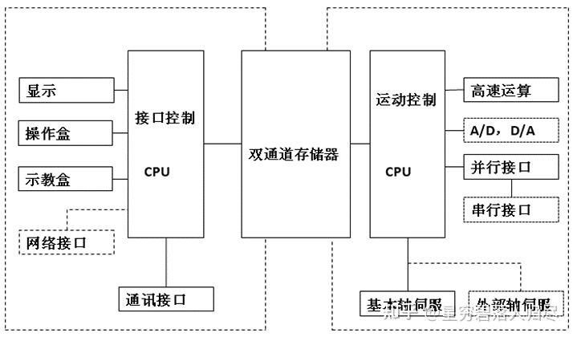

(2) 控制系统软件功能

工业机器人的柔性体现在它的运动轨迹、作业条件、作业顺序能自由变更，变更的灵活程度取决于控制系统的软件水平。

软件系统的基本功能可以归纳如下：

- 1、示教信息的输入，即面向为满足作业条件而构成的用户工作程序的编辑与修正及其人-机对话；
- 2、机器人本体及对外部设备的动作控制；
- 3、轨迹在线修正；
- 4、实时安全系统。

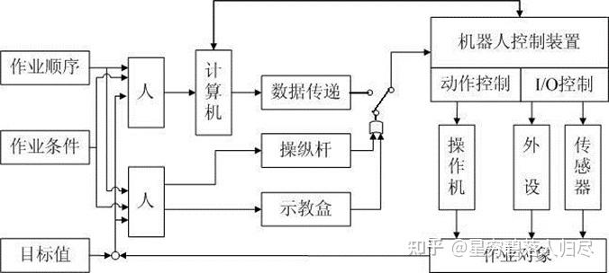

(3) 示教与再现

示教一再现 (Teaching-Playback, T/P) 方式工业机器人的基本控制思想如图。示教时，操作者通过示教盒编写运动指令，即用户工作程序，然后由计算机按照这些命令查找它相应的功能代码并存放到某个指定的示教数据区去。这个过程称之为示教编程（包括轨迹数据、作业条件、顺序等）。

再现时，机器人的计算机控制系统自动逐条取出示教命令与其他有关数据，进行解读、计算。做出判断后，将相应信号送到相应的关节伺服系统或端口，使机器人再现示教过的动作，这个过程称之为“自动翻译”。

因此，T/P 方式工业机器人的计算机软件控制系统是以“示教编程”与“自动翻译”为核心的。

#### 5.1.2 机器人位置控制

(1) 点位 (PTP) 与连续 (CP) 控制

a. PTP (Point to Point) 控制，是指我们只关心目标点，而不考虑两点（A->B）之间的运动路径。PTP 控制比较简单，一般只用于简单的搬运、送料等作业，在机器人中属低级控制水平。

b. CP (Continuous Path) 控制，是指连续路径控制，即我们不仅关心机器人到达目标点的精度，而且必须保证机器人能沿所希望的轨迹在一定精度范围内跟踪活动。

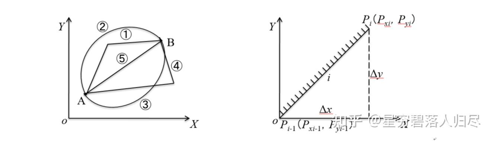

**分时控制**

先让 X 轴驱动电机运动 $$\Delta x_{N i-1} \mathrm{~mm}$$，再让 Y 轴电机运动 $$\Delta y_{N i-1} \mathrm{~mm}$$，想要得到直线轨迹，N 越大越好，即 $$\Delta x$$ 和 $$\Delta y$$ 越小越好。但理论上，不能得到真正的直线轨迹。

**同时控制**

如果控制机器人的两个轴的驱动电机，同时按某种规律完成 xi 和 yi 距离，则它们的合成轨迹就是我们所希望的直线 Pi-1-Pi。

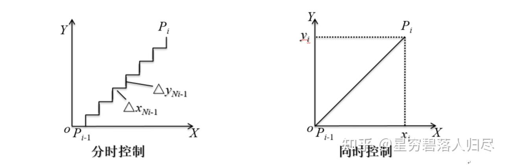

#### 5.1.3 多轴协调控制

为保证运动的连续性，要求速度连续，各轴协调，即多轴协调控制，它是机器人运动控制的关键。

希望 X 轴从起点位置 S0 以最大速度运动到终点 S3。X 轴方向的运动速度 Vx，在 S0-S1 之间，X 轴以最大加速度运动到最大稳态速度 Vmax，而在 S2-S3 之间，则是从最大负加速度到终点 S3 后停止。最大加速度与最大运动速度是由机构的刚性与驱动电机的驱动力决定的。

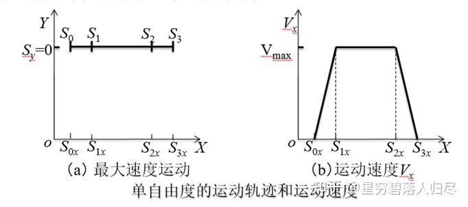

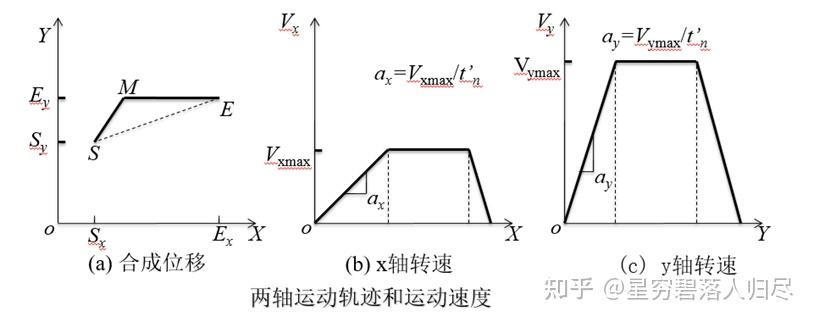

如果要求路径必须是直线 SE，则两轴不但要同时启动，而且要同时停止，即运动中的所有时刻，2 轴的位移、速度、加速度必须进行协调才能实现 SE 轨迹。

工业机器人多为 6 个自由度，为了保证空间任一轨迹（包括路径和姿态）的控制，6 个关节的独立控制协调必修满足以下条件：即在 $$t_0$$ 时刻，6 个轴的伺服电机以不同的加速度 $$\left(a_1 \sim a_6\right)$$ 同时启动；在到达 $$t_1$$ 时，同时进入稳态 $$\left(V_1 \sim V_6\right)$$；到达 $$t_2$$ 时，同时又以负加速度 $$\left(-a_1 \sim -a_6\right)$$ 减速；到达 $$t_3$$ 时，6 个伺服电机同时停止。这样我们就可以精确的实现空间任意轨迹，即机器人的多轴协调控制。

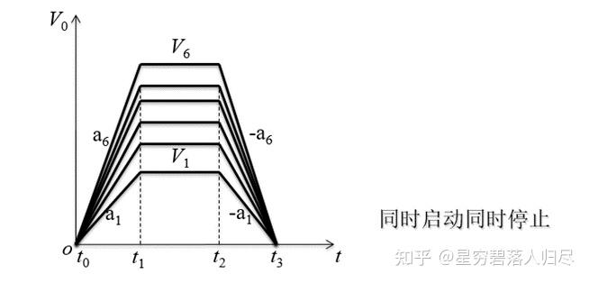

### 5.2 运动规划

机器人的规划是分层次的，先从高层的任务规划，动作规划再到手部的轨迹规划和关节轨迹规划，最后才是底层控制。

(1) 任务规划和动作规划

任务规划和动作规划属于机器人高级规划的范畴，一般依赖人来完成。机器人首先把任务分解为一系列子任务，这一层次的规划称为任务规划，然后再将每一个子任务分解为一系列动作，这一层次的规划称为动作规划。

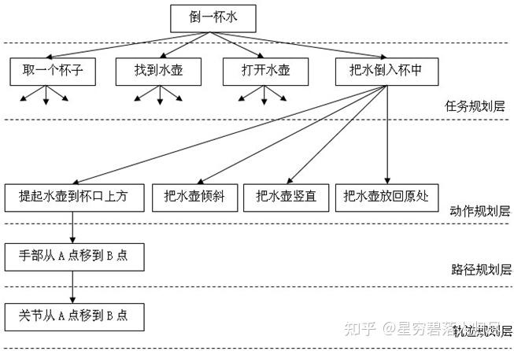

(2) 路径规划和轨迹规划

工业机器人通常具有轨迹规划和底层的控制功能，操作员只输入机械手末端的目标位置和方位，以及运动到目标点的时间（或速度），机器人控制器便可确定出达到目标的关节轨迹。

轨迹是指机器人在运动过程中随时间变换的位置、速度和加速度。它与路径不同，路径是指空间的曲线，它不包含时间的概念。

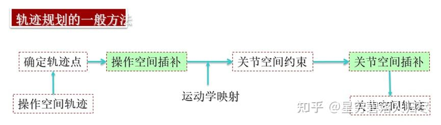

(3) 轨迹规划的基本考虑

1. 起始点、终止点、路径点：要给出介于起始点和终止点之间的中间点；
2. 在规定路径的同时，必须给出两个路径点之间的运动时间；
3. 平稳性，不平稳的运动将加剧机械部件的磨损，并导致机器人的振动和冲击。要求所选择的运动轨迹描述函数必须连续，而且它的一阶导数（速度），有时甚至二阶导数（加速度）也应该连续。

(4) 机器人轨迹的生成方式

- a、示教-再现运动。这种运动由人手把手示教机器人，定时记录各关节变量，得到沿路径运动时各关节的位移时间函数 q(t)；再现时，按内存中记录的各点的值产生序列动作。
- b、关节空间运动。这种运动直接在关节空间里进行。由于动力学参数及其极限值直接在关节空间里描述，所以用这种方式求最短时间运动很方便。
- c、空间直线运动。这是一种直角空间里的运动，它便于描述空间操作，计算量小，适宜简单的作业。
- d、空间曲线运动。这是一种在描述空间中用明确的函数表达的运动，如圆周运动、螺旋运动等。

(5) 轨迹生成的主要问题
- a、对工作对象及作业进行描述，用示教方法给出轨迹上的若干个结点(knot)。
- b、用一条轨迹通过或逼近结点，此轨迹可按一定的原则优化，如加速度平滑得到直角空间的位移时间函数 X(t) 或关节空间的位移时间函数 q(t)；在结点之间如何进行插补，即根据轨迹表达式在每一个采样周期实时计算轨迹上点的位姿和各关节变量值。
- c、以上生成的轨迹是机器人位置控制的给定值，可以据此并根据机器人的动态参数设计一定的控制规律。
- d、规划机器人的运动轨迹时，尚需明确其路径上是否存在障碍约束的组合。一般将机器人的规划与控制方式分为四种情况。

|       |  |  障碍约束   |     |
|-------|----------|----------|----------|
|         |       | 有       | 无       |
| 路径约束 | 有       | 离线无碰撞路径规则+在线路径跟踪 | 离线路径规划+在线路径跟踪 |
|       | 无       | 位置控制+在线障碍探测和避障     | 位置控制                 |

**点位控制 (PTP 控制)**：通常没有路径约束，多以关节坐标运动表示，只要求满足起终点位姿，在轨迹中间只有关节的几何限制、最大速度和加速度约束；为了保证运动的连续性，要求速度连续，各轴协调。

**连续轨迹控制 (CP 控制)**：有路径约束，因此要对路径进行设计。

| 路径控制 | 不插补                     | 关节插补(平滑)                                                                 | 空间插补                           |
|----------|----------------------------|---------------------------------------------------------------------------------|------------------------------------|
| 点位控制 PTP | (1) 各轴独立快速到达。 (2) 各关节最大加速度限制 | (1) 各轴协调运动定时插补。 (2) 各关节最大加速度限制 |                                   |
| 连续路径控制 CP |                        | (1) 在空间插补点间进行关节定时插补。 (2) 用关节的低阶多项式拟合空间直线使各轴协调运动。 (3) 各关节最大加速度限制 | (1) 直线、圆弧、曲线等距插补。 (2) 起停线速度、线加速度给定，各关节速度、加速度限制 |

### 5.3 轨迹规划

对于有规律的轨迹：

1. 示教几个特征点；
2. 利用计算机插补算法获得中间点的坐标；
3. 通过机器人逆向运动学算法由这些点的坐标求出机器人各关节的位置和角度；
4. 由后面的角位置闭环控制系统实现要求的轨迹上的一点。

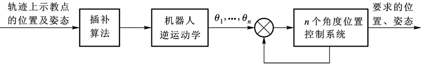

#### 5.3.1 直线插补

直线插补和圆弧插补是机器人系统中的基本插补算法。对于非直线和圆弧轨迹，可以采用直线或圆弧逼近，以实现这些轨迹。

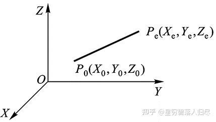

空间直线插补：是在已知该直线始末两点的位置和姿态的条件下，求各轨迹中间点（插补点）的位置和姿态。

#### 5.3.2 圆弧插补

- 1、平面圆弧插补：平面圆弧是指圆弧平面与基坐标系的三个平面之一重合，以XOY平面圆弧为例。已知不在一条直线上的三点P1、P2、P3及这三点对应的机器人手端的姿态。

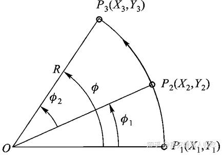

- 2、空间圆弧插补：空间圆弧是指三维空间任一平面内的圆弧，此为空间一般平面的圆弧空间圆弧插补可分三步来处理：

  - (1) 把三维问题转化成二维，找出圆弧所在平面；
  - (2) 利用二维平面插补算法求出插补点坐标(Xi+1, Yi+1)；
  - (3) 把该点的坐标值转变为基座坐标系下的值；

将三维问题转化为平面问题，应用平面圆弧插补的结论。

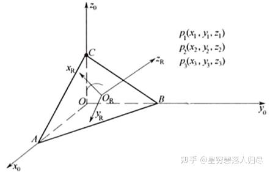

#### 5.3.3 关节空间插补

关节空间中进行轨迹规划，需要给定机器人在起始点和终止点手臂的位姿，经过插补获得连续的关节运动轨迹。

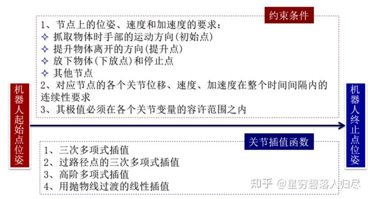

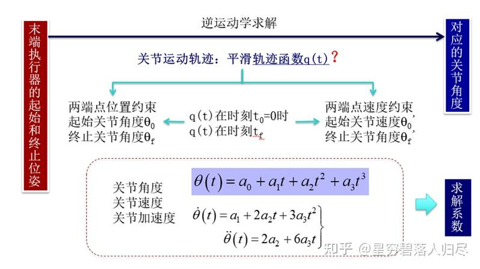

##### 三次多项式插值

$$\left.\begin{array}{l}\dot{\theta}(0)=0 \\\dot{\theta}\left(t_{f}\right)=0\end{array}\right\}$$

$$\left.\begin{array}{l}\theta_{0}=a_{0} \\\theta_{f}=a_{0}+a_{1} t_{f}+a_{2} t_{f}^{2}+a_{3} t_{f}^{3} \\0=a_{1} \\0=a_{1}+2 a_{2} t_{f}+3 a_{3} t_{f}^{2}\end{array}\right\}$$

$$\left.\begin{array}{l}a_{0}=\theta_{0} \\a_{1}=0 \\a_{2}=\frac{3}{t_{f}^{2}}\left(\theta_{f}-\theta_{0}\right) \\a_{3}=-\frac{2}{t_{f}^{3}}\left(\theta_{f}-\theta_{0}\right)\end{array}\right\}$$

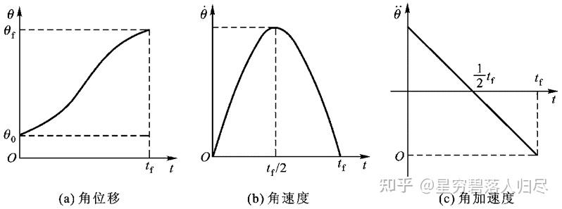

$$\dot{\theta}(t)=\theta_{0}+\frac{3}{t_{f}^{2}}\left(\theta_{f}-\theta_{0}\right) t^{2}-\frac{2}{t_{f}^{3}}\left(\theta_{f}-\theta_{0}\right) t^{3} \quad \dot{\theta}(t)=\frac{6}{t_{f}^{2}}\left(\theta_{f}-\theta_{0}\right) t-\frac{6}{t_{f}^{3}}\left(\theta_{f}-\theta_{0}\right) t^{2} \quad \ddot{\theta}(t)=\frac{6}{t_{f}^{2}}\left(\theta_{f}-\theta_{0}\right)-\frac{12}{t_{f}^{3}}\left(\theta_{f}-\theta_{0}\right) t$$

##### 过路径点的三次多项式插值

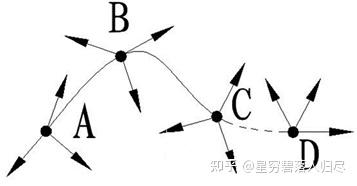

机器人作业除在 A、D 点有位姿要求外，在路径点 B、C 也有位姿要求。此外，末端执行器在路径点上的速度不为 0，则：

1）按照关节轨迹要求分段考虑；

2）确定节点关节角度和速度；

3）保证路径节点处的速度及加速度连续；

4）按照三次多项式插值方法求轨迹函数。

$$\left.\begin{array}{l}\dot{\theta}(0)=\dot{\theta}_{0} \\\dot{\theta}\left(t_{f}\right)=\dot{\theta}_{f}\end{array}\right\}$$

$$\left.\begin{array}{l}\theta_{0}=a_{0} \\\theta_{f}=a_{0}+a_{1} t_{f}+a_{2} t_{f}^{2}+a_{3} t_{f}^{3} \\\dot{\theta}=a_{1} \\\dot{\theta}_{f}=a_{1}+2 a_{2} t_{f}+3 a_{3} t_{f}^{2}\end{array}\right\}$$

$$\left.\begin{array}{l}a_{0}=\theta_{0} \\a_{1}=\dot{\theta}_{0} \\a_{2}=\frac{3}{t_{f}^{2}}\left(\theta_{f}-\theta_{0}\right)-\frac{2}{t_{f}} \dot{\theta}_{0}-\frac{1}{t_{f}} \dot{\theta}_{f} \\a_{3}=-\frac{2}{t_{f}^{3}}\left(\theta_{f}-\theta_{0}\right)+\frac{1}{t_{f}^{2}}\left(\dot{\theta}_{0}+\dot{\theta}_{f}\right)\end{array}\right\}$$

##### 高阶多项式插值

对于运动轨迹的要求更为严格，约束条件多，三次多项式不能满足需要的，须用更高阶的多项式对运动轨迹的路径段进行插值。

例：对某段路径的起始点和终止点都规定了关节的位置、速度和加速度，则要用一个五次多项式进行插值

$$\theta(t)=a_{0}+a_{1} t+a_{2} t^{2}+a_{3} t^{3}+a_{4} t^{4}+a_{5} t^{5}$$

依照前例应满足的约束条件：

$$\left.\begin{array}{l}\theta_{0}=a_{0} \\\theta_{f}=a_{0}+a_{1} t_{f}+a_{2} t_{f}^{2}+a_{3} t_{f}^{3}+a_{4} t_{f}^{4}+a_{5} t_{f}^{5} \\\dot{\theta}_{0}=a_{1} \\\dot{\theta}_{f}=a_{1}+2 a_{2} t_{f}+3 a_{3} t_{f}^{2}+4 a_{4} t_{f}^{3}+5 a_{5} t_{f}^{4} \\\ddot{\theta}_{0}=2 a_{2} \\\ddot{\theta}_{f}=2 a_{2}+6 a_{3} t_{f}+12 a_{4} t_{f}^{2}+20 a_{5} t_{f}^{3}\end{array}\right\}$$

