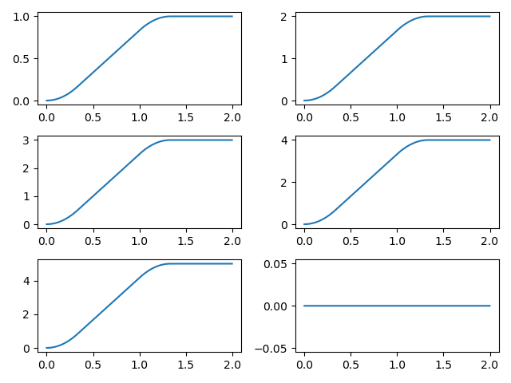
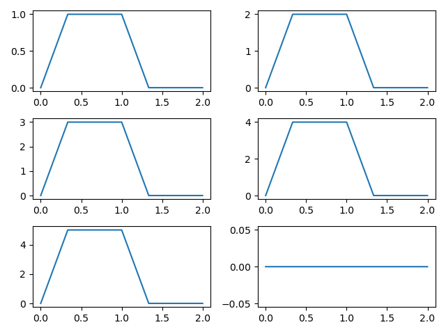
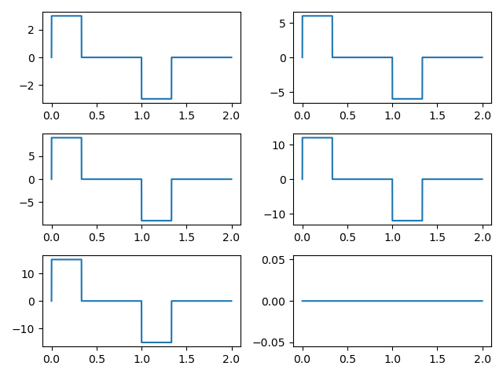

###### datetime:2024/08/26 15:55

###### author:nzb

# ‌T形速度曲线规划

```python
import matplotlib.pyplot as plt
import numpy as np


class TCurvePlanner:
    def __init__(self, q0: np.ndarray, q1: np.ndarray, vmax: np.ndarray, amax: np.ndarray) -> None:
        super().__init__()

        self._q0 = np.array(q0)
        self._q1 = np.array(q1)
        self._delta_q = self._q1 - self._q0
        # 可能会除以0
        # self.vmax_hat = np.min(np.abs(vmax / (self._q1 - self._q0)))
        # self.amax_hat = np.min(np.abs(amax / (self._q1 - self._q0)))
        # 第二种方法，可以避免除0
        # vmax / delta_q 取最小值, 反过来，delta_q / vmax 取最大值
        # 比如： 1 / [2,3,4] 取到 1/4, 反过来，[2,3,4] / 1 取到 4
        self.vmax_hat = 1 / np.max(np.abs((self._q1 - self._q0) / vmax))  # 最大速度的调整系数。
        self.amax_hat = 1 / np.max(np.abs((self._q1 - self._q0) / amax))  # 最大加速度的调整系数。

        self._ta = self.vmax_hat / self.amax_hat  # 加速时间。
        self._pa = 0.5 * self.amax_hat * np.power(self._ta, 2)  # 加速阶段的位置。
        self._tm = (1 - 2 * self._pa) / self.vmax_hat  # 匀速时间。
        self._tf = self._tm + 2 * self._ta  # 总时间。

        if self._tf - 2 * self._ta < 0:  # 如果总时间减去两倍加速时间小于零
            # 如果总时间减去两倍加速时间小于零，这表明原来的加速时间设置不合理或无法实现。
            self._ta = np.sqrt(1 / self.amax_hat)  # 将最大加速度的调整系数取倒数
            self._tf = 2 * self._ta

    @property
    def tf(self) -> float:
        return self._tf

    def get_tf(self) -> float:
        return self._tf

    def interpolate(self, t: float) -> tuple[np.ndarray, np.ndarray, np.ndarray]:
        p = 0.0
        v = 0.0
        a = 0.0
        if t <= 0.0:
            p = 0.0
            v = 0.0
            a = 0.0
        elif t <= self._ta:
            p = 0.5 * self.amax_hat * np.power(t, 2)
            v = self.amax_hat * t
            a = self.amax_hat
        elif t < self.tf - self._ta:
            p = 0.5 * self.amax_hat * np.power(self._ta, 2) + self.vmax_hat * (t - self._ta)
            v = self.vmax_hat
            a = 0.0
        elif t <= self._tf:
            p = 1 - 0.5 * self.amax_hat * np.power(self._tf - t, 2)
            v = self.amax_hat * (self._tf - t)
            a = -self.amax_hat
        else:
            p = 1
            v = 0
            a = 0
        return self._q0 + p * self._delta_q, v * self._delta_q, a * self._delta_q


if __name__ == "__main__":
    q0 = np.array([0, 0, 0, 0, 0, 0])
    q1 = np.array([1, 2, 3, 4, 5, 0])
    vmax = np.array([3, 3, 3, 5, 5, 5])
    amax = np.array([9, 9, 9, 25, 25, 25])
    planner = TCurvePlanner(q0, q1, vmax, amax)
    tf = planner.tf

    times = np.arange(0, np.ceil(tf), 0.001)

    qs = np.zeros((times.size, q0.size))
    dqs = np.zeros_like(qs)
    ddqs = np.zeros_like(qs)

    for i, t in enumerate(times):
        qs[i, :], dqs[i, :], ddqs[i, :] = planner.interpolate(t)

    plt.figure(1)
    for i in range(6):
        plt.subplot(3, 2, i + 1)
        plt.plot(times, qs[:, i])
        plt.tight_layout()

    plt.figure(2)
    for i in range(6):
        plt.subplot(3, 2, i + 1)
        plt.plot(times, dqs[:, i])
        plt.tight_layout()

    plt.figure(3)
    for i in range(6):
        plt.subplot(3, 2, i + 1)
        plt.plot(times, ddqs[:, i])
        plt.tight_layout()

    plt.show()
```
- 位置


- 速度


- 加速度


## 问题排查

比如6个电机配置了`vmax = np.array([3, 3, 3, 5, 5, 5])`和`amax = np.array([9, 9, 9, 25, 25, 25])`，
使用`lcm-spy`查看6个电机的速度曲线，发现某些电机的匀速速度跟配置的`vmax`不一致。观察发现其中某个电机能达到配置的`vmax`，那么就是该电机配置的`vmax`过小，导致其他电机只能达到该电机配置的`vmax`值，过早以该电机配置值匀速运动，需要增大该电机`vmax`，这样会使其他电机继续加速，可能会出现匀速过程，也可能只会出现匀速减速过程。