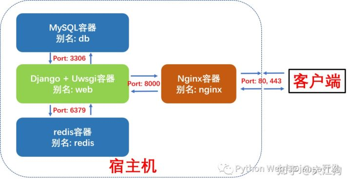

###### datetime:2020/9/2 9:35
###### author:nzb

# Docker完美部署Django Uwsgi+Nginx+MySQL+Redis

## 1、什么是docker-compose及docker-compose工具的安装

Docker-compose是一个用来定义和运行复杂应用的 Docker 工具。使用 docker-compose 后不再需要使用 shell 脚本来逐一创建和启动容器，还可以通过 docker-compose.yml 文件构建和管理复杂多容器组合。

Docker-compose的下载和安装很简单，网上有很多教程，我就不再详述了。这里只记录下ubuntu系统下docker-compose的安装过程。

```text
    # Step 1: 以ubuntu为例，下载docker-compose
    $ sudo curl -L https://github.com/docker/compose/releases/download/1.17.0/docker-compose-`uname -s`-`uname -m` -o /usr/local/bin/docker-compose
    # Step 2: 给予docker-compose可执行权限
    $ sudo chmod +x /usr/local/bin/docker-compose
    # Step 3: 查看docker-compose版本
    $ docker-compose --version
```

注意：安装docker-compose前必需先安装好docker。

## 2、Django + Uwsgi + Nginx + MySQL + Redis组合容器示意图

本例中我们将使用docker-compose编排并启动4个容器，这更接近于实际生成环境下的部署。

- Django + Uwsgi容器：核心应用程序，处理动态请求
- MySQL 容器：数据库服务
- Redis 容器：缓存服务
- Nginx容器：反向代理服务并处理静态资源请求

这四个容器的依赖关系是：Django+Uwsgi 容器依赖 Redis 容器和 MySQL 容器，Nginx 容器依赖Django+Uwsgi容器。为了方便容器间的相互访问和通信，我们使用docker-compose时可以给每个容器取个别名，这样访问容器时就可以直接使用别名访问，而不使用Docker临时给容器分配的IP了。

这四个容器的别名及通信端口如下图所示：



### 2.1、Docker-compose部署Django项目布局树形图

我们新建了一个compose文件夹，专门存放用于构建其它容器镜像的Dockerfile及配置文件。compose文件夹与django项目的根目录myproject同级。这样做的好处是不同的django项目可以共享compose文件夹。

```text
myproject_docker # 项目根目录
 ├── compose # 存放各项容器服务的Dockerfile和配置文件
 │   ├── mysql
 │   │   ├── conf
 │   │   │   └── my.cnf # MySQL配置文件
 │   │   └── init
 │   │       └── init.sql # MySQL启动脚本
 │   ├── nginx
 │   │   ├── Dockerfile # 构建Nginx镜像所的Dockerfile
 │   │   ├── log # 挂载保存nginx容器内nginx日志
 │   │   ├── nginx.conf # Nginx配置文件
 │   │   └── ssl # 如果需要配置https需要用到
 │   ├── redis
 │   │   └── redis.conf # redis配置文件
 │   └── uwsgi # 挂载保存django+uwsgi容器内uwsgi日志
 ├── docker-compose.yml # 核心编排文件
 ├── web-pc     # 前端项目文件夹
 |   └── index.html # 首页
 └── myproject # 常规Django项目目录
    ├── Dockerfile # 构建Django+Uwsgi镜像的Dockerfile
    ├── apps # 存放Django项目的各个apps
    ├── manage.py
    ├── myproject # Django项目配置文件
    │   ├── asgi.py
    │   ├── __init__.py
    │   ├── settings.py
    │   ├── urls.py
    │   └── wsgi.py
    ├── pip.conf # 非必需。pypi源设置成国内，加速pip安装
    ├── requirements.txt # Django项目依赖文件
    ├── start.sh # 启动Django+Uwsgi容器后要执行的脚本
    ├── media # 用户上传的媒体资源与静态文件
    ├── static # 项目所使用到的静态文件
    └── uwsgi.ini # uwsgi配置文件
```

### 2.2、第一步：编写docker-compose.yml文件

docker-compose.yml的核心内容如下。我们定义了3个数据卷，用于挂载各个容器内动态生成的数据，比如MySQL的存储数据，redis生成的快照和django容器中用户上传的媒体资源与文件。这样即使删除容器，容器内产生的数据也不会丢失。我们还编排了4项容器服务，别名分别为redis, db, nginx和web，接下来我们将依次看看各个容器的Dockerfile和配置文件。
```text
    version: "3"
    
    volumes: # 自定义数据卷，位于宿主机/var/lib/docker/volumes内
        myproject_db_vol: # 定义数据卷同步容器内mysql数据
        myproject_redis_vol: # 定义数据卷同步redis容器内数据
        myproject_media_vol: # 定义数据卷同步media文件夹数据
    
    services:
        redis:
            image: redis:5
            command: redis-server /etc/redis/redis.conf # 容器启动后启动redis服务器
            volumes:
               - myproject_redis_vol:/data # 通过挂载给redis数据备份
               - ./compose/redis/redis.conf:/etc/redis/redis.conf # 挂载redis配置文件
            ports:
               - "6379:6379"
            restart: always # always表容器运行发生错误时一直重启
        
        db:
            image: mysql:5.7
            environment:
               - MYSQL_ROOT_PASSWORD=123456 # 数据库密码
               - MYSQL_DATABASE=myproject # 数据库名称
               - MYSQL_USER=dbuser # 数据库用户名
               - MYSQL_PASSWORD=password # 用户密码
            
            volumes:
               - myproject_db_vol:/var/lib/mysql:rw # 挂载数据库数据, 可读可写
               - ./compose/mysql/conf/my.cnf:/etc/mysql/my.cnf # 挂载配置文件
               - ./compose/mysql/init:/docker-entrypoint-initdb.d/ # 挂载数据初始化sql脚本
            ports:
               - "3306:3306" # 与配置文件保持一致
            restart: always
        
        web:
            build: ./myproject # 使用myproject目录下的Dockerfile
            expose:
               - "8000"
            volumes:
               - ./myproject:/var/www/html/myproject # 挂载项目代码
               - myproject_media_vol:/var/www/html/myproject/media # 以数据卷挂载容器内用户上传媒体文件
               - ./compose/uwsgi:/tmp # 挂载uwsgi日志
            links:
               - db
               - redis
            depends_on: # 依赖关系
               - db
               - redis
            environment:
               - DEBUG=False
             restart: always
            tty: true
            stdin_open: true
        
        nginx:
            build: ./compose/nginx
            ports:
               - "80:80"
               - "443:443"
            expose:
               - "80"
            volumes:
               - ./myproject/static:/usr/share/nginx/html/static # 挂载静态文件
               - ./compose/nginx/ssl:/usr/share/nginx/ssl # 挂载ssl证书目录
               - ./compose/nginx/log:/var/log/nginx # 挂载日志
               - myproject_media_vol:/usr/share/nginx/html/media # 挂载用户上传媒体文件
               - ./web-pc:/var/www/html/myproject-pc            # 挂载前端页面             
            links:
               - web
            depends_on:
               - web
            restart: always
```

### 2.3、第二步：编写Web (Django+Uwsgi)镜像和容器所需文件

构建Web镜像(Django+Uwsgi)的所使用的Dockerfile如下所示:
```text
    # myproject/Dockerfile
    # 建立 python3.7 环境
    FROM python:3.7
    
    # 镜像作者大江狗
    MAINTAINER DJG
    
    # 设置 python 环境变量
    ENV PYTHONUNBUFFERED 1
    
    COPY pip.conf /root/.pip/pip.conf
    
    # 创建 myproject 文件夹
    RUN mkdir -p /var/www/html/myproject
    
    # 将 myproject 文件夹为工作目录
    WORKDIR /var/www/html/myproject
    
    # 将当前目录加入到工作目录中（. 表示当前目录）
    ADD . /var/www/html/myproject
    
    # 更新pip版本
    RUN /usr/local/bin/python -m pip install --upgrade pip
    
    # 利用 pip 安装依赖
    RUN pip install -r requirements.txt
    
    # 去除windows系统编辑文件中多余的\r回车空格
    RUN sed -i 's/\r//' ./start.sh
    
    # 给start.sh可执行权限
    RUN chmod +x ./start.sh
```

`start.sh`脚本文件内容如下所示。最重要的是最后一句，使用uwsgi.ini配置文件启动Django服务。
```text
    #!/bin/bash
    # 从第一行到最后一行分别表示：
    # 1. 收集静态文件到根目录，
    # 2. 生成数据库可执行文件，
    # 3. 根据数据库可执行文件来修改数据库
    # 4. 用 uwsgi启动 django 服务
    python manage.py collectstatic --noinput&&
    python manage.py makemigrations&&
    python manage.py migrate&&
    uwsgi --ini /var/www/html/myproject/uwsgi.ini
```
`uwsgi.ini`配置文件如下所示：
```text
    [uwsgi]
    
    project=myproject
    uid=www-data
    gid=www-data
    base=/var/www/html
    
    chdir=%(base)/%(project)
    module=%(project).wsgi:application
    master=True
    processes=2
    
    socket=0.0.0.0:8000
    chown-socket=%(uid):www-data
    chmod-socket=664
    
    vacuum=True
    max-requests=5000
    
    pidfile=/tmp/%(project)-master.pid
    daemonize=/tmp/%(project)-uwsgi.log
    
    #设置一个请求的超时时间(秒)，如果一个请求超过了这个时间，则请求被丢弃
    harakiri = 60
    post buffering = 8192
    buffer-size= 65535
    #当一个请求被harakiri杀掉会，会输出一条日志
    harakiri-verbose = true
    
    #开启内存使用情况报告
    memory-report = true
    
    #设置平滑的重启（直到处理完接收到的请求）的长等待时间(秒)
    reload-mercy = 10
    
    #设置工作进程使用虚拟内存超过N MB就回收重启
    reload-on-as= 1024
    python-autoreload=1
```

### 2.4、编写Nginx镜像和容器所需文件
构建Nginx镜像所使用的Dockerfile如下所示：
```text
    # nginx镜像compose/nginx/Dockerfile
    
    FROM nginx:latest
    
    # 删除原有配置文件，创建静态资源文件夹和ssl证书保存文件夹
    RUN rm /etc/nginx/conf.d/default.conf \
    && mkdir -p /usr/share/nginx/html/static \
    && mkdir -p /usr/share/nginx/html/media \
    && mkdir -p /usr/share/nginx/ssl
    
    # 设置Media文件夹用户和用户组为Linux默认www-data, 并给予可读和可执行权限,
    # 否则用户上传的图片无法正确显示。
    RUN chown -R www-data:www-data /usr/share/nginx/html/media \
    && chmod -R 775 /usr/share/nginx/html/media
    
    # 添加配置文件
    ADD ./nginx.conf /etc/nginx/conf.d/
    
    # 关闭守护模式
    CMD ["nginx", "-g", "daemon off;"]
```

Nginx的配置文件如下所示
```text
    # nginx配置文件
    # compose/nginx/nginx.conf
    
    upstream django {
        ip_hash;
        server web:8000; # Docker-compose web服务端口
    }
    
    server {
        listen 80; # 监听80端口
        server_name localhost; # 可以是nginx容器所在ip地址或127.0.0.1，不能写宿主机外网ip地址
        
        charset utf-8;
        client_max_body_size 10M; # 限制用户上传文件大小
        
        location /static {
            alias /usr/share/nginx/html/static; # 静态资源路径
        }
        
        location /media {
            alias /usr/share/nginx/html/media; # 媒体资源，用户上传文件路径
        }
        
        location /web-pc {
            alias /var/www/html/myproject-pc;  # 前端文件
        }
        
        location / {
            include /etc/nginx/uwsgi_params;
            uwsgi_pass django;
            uwsgi_read_timeout 600;
            uwsgi_connect_timeout 600;
            uwsgi_send_timeout 600;
        
            proxy_set_header X-Forwarded-For $proxy_add_x_forwarded_for;
            proxy_set_header Host $http_host;
            proxy_redirect off;
            proxy_set_header X-Real-IP  $remote_addr;
            # proxy_pass http://django; # 使用uwsgi通信，而不是http，所以不使用proxy_pass。
        }
    }
    
    access_log /var/log/nginx/access.log main;
    error_log /var/log/nginx/error.log warn;
    
    server_tokens off;
```

### 2.5、编写Db (MySQL)容器配置文件
启动MySQL容器我们直接使用官方镜像即可，不过我们需要给MySQL增加配置文件。
```text
    # compose/mysql/conf/my.cnf
    [mysqld]
    user=mysql
    default-storage-engine=INNODB
    character-set-server=utf8
    
    port            = 3306 # 端口与docker-compose里映射端口保持一致
    #bind-address= localhost #一定要注释掉，mysql所在容器和django所在容器不同IP
    
    basedir         = /usr
    datadir         = /var/lib/mysql
    tmpdir          = /tmp
    pid-file        = /var/run/mysqld/mysqld.pid
    socket          = /var/run/mysqld/mysqld.sock
    skip-name-resolve  # 这个参数是禁止域名解析的，远程访问推荐开启skip_name_resolve。
    
    [client]
    port = 3306
    default-character-set=utf8
    
    [mysql]
    no-auto-rehash
    default-character-set=utf8
```
我们还需设置MySQL服务启动时需要执行的脚本命令, 注意这里的用户名和password必需和docker-compose.yml里与MySQL相关的环境变量保持一致。
```text
    # compose/mysql/init/init.sql
    GRANT ALL PRIVILEGES ON myproject.* TO dbuser@"%" IDENTIFIED BY "password";
    FLUSH PRIVILEGES;
```

### 2.6、编写Redis 容器配置文件
启动redis容器我们直接使用官方镜像即可，不过我们需要给redis增加配置文件。大部分情况下采用默认配置就好了，这里我们只做出了如下几条核心改动：
```text
    # compose/redis/redis.conf
    # Redis 5配置文件下载地址
    # https://raw.githubusercontent.com/antirez/redis/5.0/redis.conf
    
    # 请注释掉下面一行，变成#bind 127.0.0.1,这样其它机器或容器也可访问
    bind 127.0.0.1
    
    # 取消下行注释，给redis设置登录密码。这个密码django settings.py会用到。
    requirepass yourpassword
```

### 2.7、修改Django项目settings.py
在你准备好docker-compose.yml并编排好各容器的Dockerfile及配置文件后，请先不要急于使用Docker-compose命令构建镜像和启动容器。这时还有一件非常重要的事情要做，那就是修改Django的settings.py, 提供mysql和redis服务的配置信息。最重要的几项配置如下所示：
```text
    # 这是基本的配置，按需添加
    # 生产环境设置 Debug = False
    Debug = False
    
    # 设置ALLOWED HOSTS
    ALLOWED_HOSTS = ['your_server_IP', 'your_domain_name']
    
    # 设置STATIC ROOT 和 STATIC URL
    STATIC_ROOT = os.path.join(BASE_DIR, 'static')
    STATIC_URL = "/static/"
    
    # 设置MEDIA ROOT 和 MEDIA URL
    MEDIA_ROOT = os.path.join(BASE_DIR, 'media')
    MEDIA_URL = "/media/"
    
    # 设置数据库。这里用户名和密码必需和docker-compose.yml里mysql环境变量保持一致
    DATABASES = {
     'default': {
         'ENGINE': 'django.db.backends.mysql',
         'NAME': 'myproject', # 数据库名
         'USER':'dbuser', # 你设置的用户名 - 非root用户
         'PASSWORD':'password', # # 换成你自己密码
         'HOST': 'db', # 注意：这里使用的是db别名，docker会自动解析成ip
         'PORT':'3306', # 端口
    }
    }
    
    # 设置redis缓存。这里密码为redis.conf里设置的密码
    CACHES = {
     "default": {
         "BACKEND": "django_redis.cache.RedisCache",
         "LOCATION": "redis://redis:6379/1", #这里直接使用redis别名作为host ip地址
         "OPTIONS": {
             "CLIENT_CLASS": "django_redis.client.DefaultClient",
             "PASSWORD": "yourpassword", # 换成你自己密码
         },
     }
    }
```

### 2.8、使用docker-compose 构建镜像并启动容器组服务
现在我们可以使用docker-compose命名构建镜像并启动容器组了。
```text
    # 进入docker-compose.yml所在文件夹，输入以下命令构建镜像
    sudo docker-compose build
    # 查看已生成的镜像
    sudo docker images
    # 启动容器组服务
    sudo docker-compose up
    # 查看运行中的容器
    sudo docker ps
```

### 2.9、进入web容器内执行Django命令并启动uwsgi服务器
虽然我们四个容器都已启动运行，但我们还没有执行Django相关命令并启动uwsgi服务器。现在我们只需进入web容器执行我们先前编写的脚本文件`start.sh`即可。
```text
    sudo docker exec -it myprojectdocker_web_1 /bin/bash start.sh
```
此时打开你的浏览器，输入你服务器的ip地址或域名指向地址，你就应该可以看到网站已经上线啦。

## 3、注意事项

- 配置文件严格注意不要有多余空格（特别是docker-compose.yml）
- django项目启动已经数据库更新命令
    - sudo docker exec -it myprojectdocker_web_1 /bin/bash start.sh
- 默认情况下，`docker-compose up`启动的容器都在前台，控制台将会同时打印所有容器的输出信息，
可以很方便进行调试。当通过Ctrl+c停止命令时，所有容器将会停止。如果希望在后台启动并运行所有的容器，
使用`docker-compose up -d`。如果服务容器已经存在，并且在创建容器后更改了服务的配置(即docker-compose.yml文件)或者镜像，
那么docker-compose会停止容器，然后重新创建容器。
- 修改文件只需要在宿主机上修改（比如配置文件，django项目）
- 常用命令（需要进入对应目录）
    - `docker-compose up -d`：启动容器，启动容器后，django项目需要运行sudo docker exec -it myprojectdocker_web_1 /bin/bash start.sh
    - `docker-compose stop`：停止容器