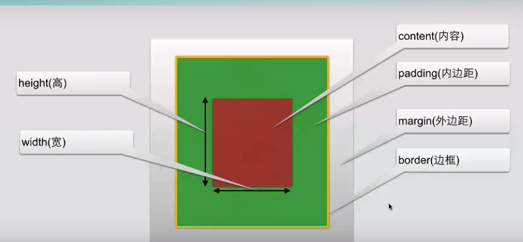
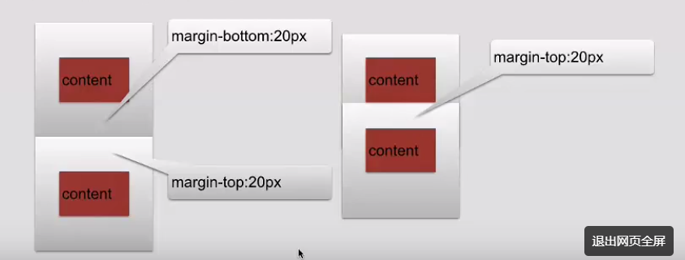
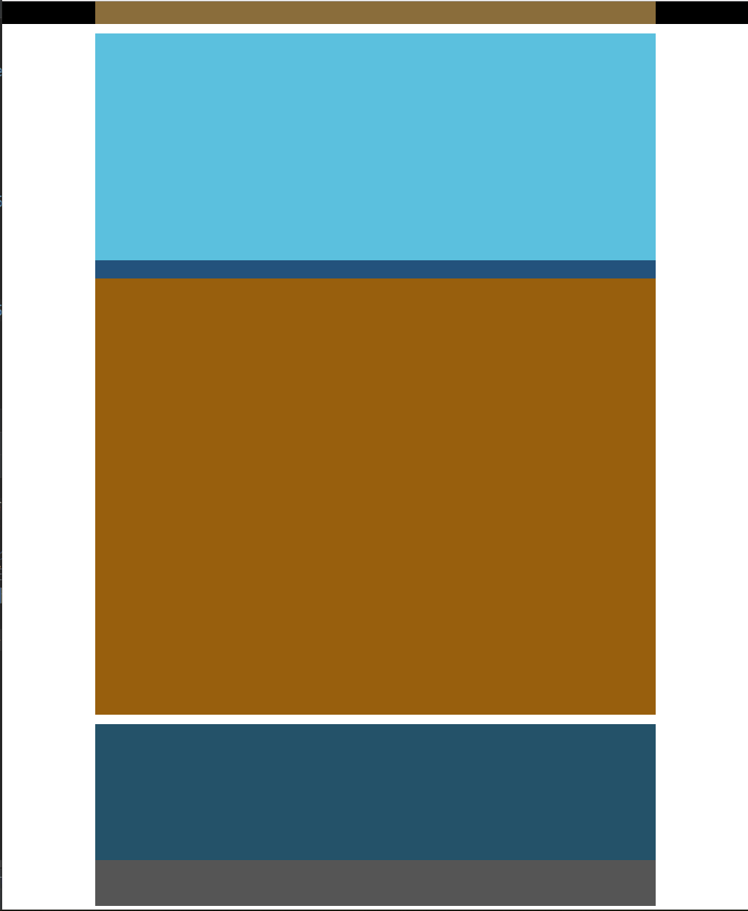
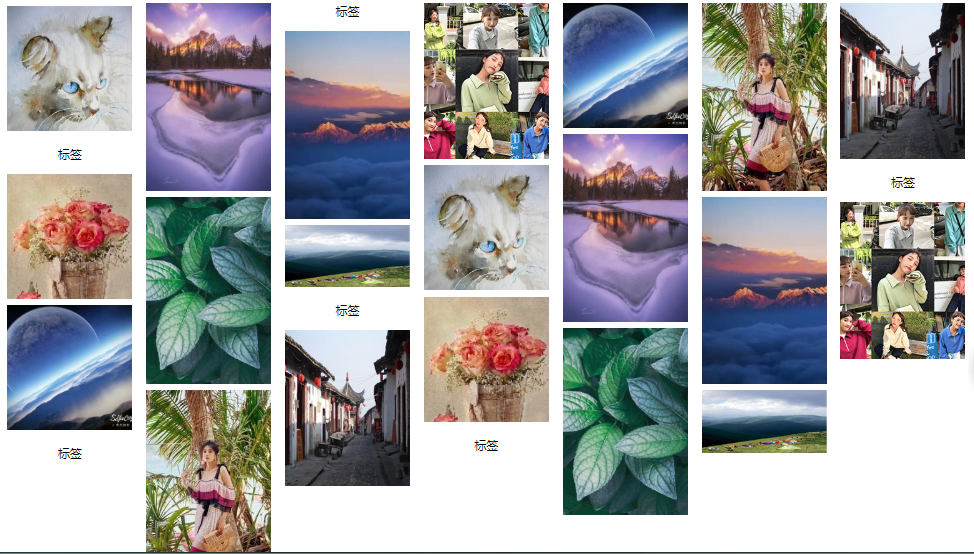

###### datetime:2019/7/2 9:40
###### author:nzb

## CSS基础语法

- `selector {
        property:value
    }`
    
    例：`h1{color:red;font-size:14px;}`
    
    属性大于1个之后，属性之间用分号隔开，如果值大于一个单词，则需要加上引号：`p{font-family:"sans serif"}`

- 浏览器读取 CSS 的顺序是从上到下，这意味着，在发生冲突时，浏览器会使用最后的 CSS 声明。后面的会覆盖前面的。
- id 声明都会覆盖 class 声明。行内样式会覆盖其他声明。
- 多情况下，你会使用 CSS 库，这些库可能会意外覆盖掉你自己的 CSS。所以当你需要确保某元素具有指定的 CSS 时，你可以使用 !important。

## CSS高级语法

- 选择器分组：
    `h1,h2,h3,h4,h5{color:red;}`

- 继承：`body{color:green}`

## 派生选择器

- 通过依据元素在其位置的上下文关系来定义样式
```html
    <!DOCTYPE html>
    <html lang="en">
    <head>
        <meta charset="UTF-8">
        <title>address元素</title>
        <style>
            li strong{
                color: red;
            }
            strong{
                color: gray;
            }
        </style>
    </head>
    <body>
        <p><strong>文章1</strong></p>
        <ul>
            <li>
                <strong>文章2</strong>
            </li>
        </ul></p>
    </body>
    </html>
```

## id选择器

- id选择器可以为标有id的HTML元素指定特定的样式
- id选择器以"#"来定义
- 目前比较常用的方式是id选择器常常用于建立派生选择器
```html
    <!DOCTYPE html>
    <html lang="en">
    <head>
        <meta charset="UTF-8">
        <title>address元素</title>
        <style>
            #div1{
                color: red;
            }
            #div1 a{
                color: blue;
            }
        </style>
    </head>
    <body>
        <div id="div1">
            这是一个div
            <a>这是超链接</a>
        </div>
    </body>
    </html>
```

## 类选择器

- 类选择器以一个点显示
- class也可以作为派生选择器
```html
    <!DOCTYPE html>
    <html lang="en">
    <head>
        <meta charset="UTF-8">
        <title>address元素</title>
        <style>
            .dclass p{
                color: red;
            }
        </style>
    </head>
    <body>
        <div class="dclass">
            <p class="pclass">这是一个p标签</p>
        </div>
    </body>
    </html>
```

## 属性选择器
    
- 属性选择器：对带有指定属性的HTML元素设置样式
- 属性和值选择器
```html
    <!DOCTYPE html>
    <html lang="en">
    <head>
        <meta charset="UTF-8">
        <title>address元素</title>
        <style type="text/css">
            [title]{
                color:red;
            }
            [title=te]{
                color: blue;
            }
        </style>
    </head>
    <body>
        <div class="dclass">
            <p class="pclass" title="t">这是一个p标签</p>
            <p class="pclass" title="te">这是一个p标签</p>
        </div>
    </body>
    </html>
```

## CSS背景

- CSS允许应用纯色作为背景，也允许使用背景图像创建相当复杂的效果

| 属性 | 描述 |
|------|-----|
|backgroud-attachment| 背景图是否或者随着页面的其余部分滚动 |
|backgroud-color  | 设置元素的背景颜色 |
|backgroud-image  | 把图片设置为背景 |
|backgroud-position  | 设置背景图片的起始位置 |
|backgroud-repeat  | 设置背景图片是否及如何重复 |
|backgroud-size  | 规定背景图片的尺寸 |
|backgroud-origin  | 规定背景图片的定位区域 |
|backgroud-clip  | 规定背景的绘制区域 |

## CSS文本

| 属性 | 描述 |
|------|-----|
| color | 文本颜色 |
| direction | 文本方向 |
| line-height | 行高 |
| letter-spacing | 字符间距 |
| text-align | 对齐元素中的文本 | 
| text-decoration | 向文本添加修饰 |
| text-indent | 缩进元素中文本的首行 |
| text-transform | 元素中的字母 | 
| unicode-bidi | 设置文本方向 |
| white-space | 元素中空白的处理方式 | 
| word-spacing | 字间距 |

- CSS3文本效果

| 属性 | 描述 |
|------|-----|
| text-shadow | 向文本添加阴影 |
| word-wrap | 规定文本的换行规则 |

## CSS 字体

- CSS字体属性定义文本的字体系列、大小、加粗、风格和变形

| 属性 | 描述 |
|------|-----|
| font-family | 设置字体系列 |
| font-size | 设置字体的尺寸 |
| font-style | 设置字体风格 |
| font-variant | 以小型大写字体或正常字体显示文本 |
| font-weight | 设置字体的粗细 |

## CSS链接

- CSS链接的四种状态
    - a:link 普通的、未被访问的链接
    - a:visited 用户已访问的链接
    - a:hover 鼠标指针位于链接的上方
    - a:active 链接被点击的时刻

- 常见的链接方式
    - text-decoration 属性大多用于去掉链接中的下划线
    
- 设置背景颜色
    -backgroud-color

## CSS列表

- CSS列表属性允许你放置、改变列表标志，或者将图像作为列表项标志

| 属性 | 描述 |
|------|-----|
| list-style | 简写列表项 |
| list-style-image | 列表项图像 |
| list-style-position | 列表标志位置 |
| list-style-type | 列表类型 |

## CSS表格

- 指定CSS表格边框，使用border属性。
- border-collapse 属性设置表格的边框是否被折叠成一个单一的边框或隔开：
- Width和height属性定义表格的宽度和高度。
- 表格中的文本对齐和垂直对齐属性。text-align属性设置水平对齐方式，向左，右，或中心：
- 表格填充：padding
- 表格颜色：color

## CSS轮廓

| 属性 | 描述 |
|------|-----|
| outline | 设置轮廓属性 |
| outline-color | 设置轮廓的颜色 |
| outline-style | 设置轮廓的样式 |
| outline-width | 设置轮廓的宽度 |

## CSS定位

- CSS定位
    - 改变元素在页面上的位置

- CSS定位机制
    - 普通流：元素按照其在HTML中的位置顺序决定排布的过程
    - 浮动
    - 绝对布局

- CSS定位属性

| 属性 | 描述 |
|------|-----|
| position | 把元素放在一个静态的、相对的、绝对的、或固定的位置中 |
| top | 元素向上的偏移量 |
| left | 元素向左的偏移量 |
| right | 元素向右的偏移量 |
| bottom | 元素向下的偏移量 |
| overflow | 设置元素溢出其区域发生的事情 |
| clip | 设置元素显示的形状 |
| vertical-align | 设置元素垂直对齐方式 |
| z-index | 设置元素的堆叠顺序 |

- position 属性的五个值：
    - static：HTML 元素的默认值，即没有定位，遵循正常的文档流对象。静态定位的元素不会受到 top, bottom, left, right影响。
    - relative：元素的位置相对于浏览器窗口是固定位置。即使窗口是滚动的它也不会移动：
    - fixed：相对定位元素的定位是相对其正常位置。移动相对定位元素，但它原本所占的空间不会改变。相对定位元素经常被用来作为绝对定位元素的容器块。
    - absolute：绝对定位的元素的位置相对于最近的已定位父元素，如果元素没有已定位的父元素，那么它的位置相对于`<html>`。absolute 定位使元素的位置与文档流无关，因此不占据空间。absolute 定位的元素和其他元素重叠。
    - sticky：sticky 英文字面意思是粘，粘贴，所以可以把它称之为粘性定位。position: sticky; 基于用户的滚动位置来定位。粘性定位的元素是依赖于用户的滚动，在 position:relative 与 position:fixed 定位之间切换。它的行为就像 position:relative; 而当页面滚动超出目标区域时，它的表现就像 position:fixed;，它会固定在目标位置。元素定位表现为在跨越特定阈值前为相对定位，之后为固定定位。这个特定阈值指的是 top, right, bottom 或 left 之一，换言之，指定 top, right, bottom 或 left 四个阈值其中之一，才可使粘性定位生效。否则其行为与相对定位相同。

- 重叠的元素
    - 元素的定位与文档流无关，所以它们可以覆盖页面上的其它元素
    - z-index属性指定了一个元素的堆叠顺序（哪个元素应该放在前面，或后面）
    - 一个元素可以有正数或负数的堆叠顺序：
    - 具有更高堆叠顺序的元素总是在较低的堆叠顺序元素的前面。
    - **注意**： 如果两个定位元素重叠，没有指定z - index，最后定位在HTML代码中的元素将被显示在最前面。

## CSS浮动

- 浮动：
    - float属性可用的值：
        - left：元素向左浮动
        - right：元素向右浮动
        - none：元素不浮动
        - inherit：从父级继承浮动属性
- clear属性：
    - 去掉浮动属性(包括继承来的属性)
    - clear属性值：
        - left、right：去掉元素向左、向右浮动
        - both：左右两侧去掉浮动
        - inherit：从父级继承来clear的值

## 盒子模型

- 概述
    
    margin、border、padding、content部分组成
    
    
       
- 内边距
    - padding
    - padding-top
    - padding-bottom
    - padding-right
    - padding-left

- 边框
    - CSS边框
       - 我们可以创建出效果出色的边框，并且可以应用于任何元素
    - 边框的样式：
        - boder-style：定义了10个不同的非继承样式，包括none
            - none: 默认无边框
            - dotted: 定义一个点线边框
            - dashed: 定义一个虚线边框
            - solid: 定义实线边框
            - double: 定义两个边框。 两个边框的宽度和 border-width 的值相同
            - groove: 定义3D沟槽边框。效果取决于边框的颜色值
            - ridge: 定义3D脊边框。效果取决于边框的颜色值
            - inset:定义一个3D的嵌入边框。效果取决于边框的颜色值
            - outset: 定义一个3D突出边框。 效果取决于边框的颜色值
        - 单边框样式
            - border-top-style
            - border-right-style
            - border-bottom-style
            - border-left-style
    - 边框宽度
        - border-width：可以指定长度值，比如 2px 或 0.1em(单位为 px, pt, cm, em 等)，或者使用 3 个关键字之一，它们分别是 thick 、medium（默认值） 和 thin。
        - 单边框宽度
            - border-top-width
            - border-right-width
            - border-bottom-width
            - border-left-width
    - 边框颜色
        - border-color
        - 单边框颜色
            - border-top-color
            - border-right-color
            - border-bottom-color
            - border-left-color    
    - CSS3边框
        - border-image：设置所有边框图像的速记属性。
        - border-radius	：一个用于设置所有四个边框-*-半径属性的速记属性
        - box-shadow：附加一个或多个下拉框的阴影

- 外边距

| 属性 | 描述 |
|------|------|
| margin | 简写属性。在一个声明中设置所有外边距属性, 如margin：上下，左右。也可以auto自适应会居中 |
| margin-bottom | 设置元素的下外边距 |
| margin-left | 设置元素的左外边距 |
| margin-right | 设置元素的右外边距 |
| margin-top | 设置元素的上外边距 |

- 外边距合并
    - 外边距合并就是第一个叠加的概念
    
    

## 盒子模型应用



```html
    <!DOCTYPE html>
    <html lang="en">
    <head>
        <meta charset="UTF-8">
        <title>盒子模型</title>
        <style type="text/css">
            *{
                margin: 0px;
                padding: 0px;
            }
            .top{
                width: 100%;
                height: 50px;
                background-color: black;
            }
            .top_content{
                width: 75%;
                height: 50px;
                background-color: #8a6d3b;
                margin: 0px auto;
            }
            .body{
                margin: 20px auto;
                width: 75%;
                height: 1500px;
                background-color: #9d9d9d;
            }
            .body_img{
                width: 100%;
                height: 500px;
                background-color: #5bc0de;
            }
            .body_content{
                width: 100%;
                height: 1000px;
                background-color: #985f0d;
            }
            .body_no{
                width: 100%;
                height: 40px;
                background-color: #23527c;
            }
            .footing{
                width: 75%;
                height: 400px;
                background-color: #a6e1ec;
                margin: 0 auto;
            }
            .footing_content{
                width: 100%;
                height: 300px;
                background-color: #245269;
            }
            .footing_subnav{
                width: 100%;
                height: 100px;
                background-color: #555555;
            }
        </style>
    </head>
    <body>
        <div class="top">
            <div class="top_content"></div>
        </div>
        <div class="body">
            <div class="body_img"></div>
            <div class="body_content">
                <div class="body_no"></div>
            </div>
        </div>
        <div class="footing">
            <div class="footing_content"></div>
            <div class="footing_subnav"></div>
        </div>
    </body>
    </html>
```

## CSS对齐-水平&垂直对齐

- 元素居中对齐
    - 要水平居中对齐一个元素(如 `<div>`), 可以使用 margin: auto;。
    - 设置到元素的宽度将防止它溢出到容器的边缘。
    - 元素通过指定宽度，并将两边的空外边距平均分配：
    - **注意**: 如果没有设置 width 属性(或者设置 100%)，居中对齐将不起作用。

- 文本居中对齐
    
    如果仅仅是为了文本在元素内居中对齐，可以使用 text-align: center;

- 图片居中对齐

    要让图片居中对齐, 可以使用 margin: auto; 并将它放到 块 元素中:

- 左右对齐 - 使用定位方式
    
    我们可以使用 position: absolute; 属性来对齐元素:

```html
    .right {
        position: absolute;
        right: 0px;
        width: 300px;
        border: 3px solid #73AD21;
        padding: 10px;
    }
```
注释：绝对定位元素会被从正常流中删除，并且能够交叠元素。

**提示:** 当使用 position 来对齐元素时, 通常 <body> 元素会设置 margin 和 padding 。 这样可以避免在不同的浏览器中出现可见的差异。
```html
    body {
        margin: 0;
        padding: 0;
    }
     
    .container {
        position: relative;
        width: 100%;
    }
     
    .right {
        position: absolute;
        right: 0px;
        width: 300px;
        background-color: #b0e0e6;
    }
```

- 左右对齐 - 使用 float 方式

    我们也可以使用 float 属性来对齐元素
    
- 垂直居中对齐 - 使用 padding
    - CSS 中有很多方式可以实现垂直居中对齐。 一个简单的方式就是头部顶部使用 padding
    - 如果要水平和垂直都居中，可以使用 padding 和 text-align: center:

- 垂直居中 - 使用 line-height

- 垂直居中 - 使用 position 和 transform

## CSS尺寸

| 属性 | 描述 |
|------|-----|
| height | 设置元素的高度 |
| line-height | 设置行高 |
| max-height | 设置元素的最大高度 |
| max-width | 设置元素的最大宽度 |
| min-height | 设置元素的最小高度 |
| min-width | 设置元素的最小宽度 |
| width | 设置元素的宽度 |

## CSS分类

| 属性 | 描述 |
|------|-----|
| clear | 设置一个元素的侧面是否允许其他的浮动元素 |
| cursor | 规定当指向某元素之上时显示的指针类型 |
| display | 设置是否及如何显示元素 |
| float | 定义元素在那个方向浮动 | 
| position | 把元素放置到一个静态的、相对的、绝对的、固定的位置 |
| visibility | 设置元素是否看见或不可见 |

- CSS中块级、内联元素的应用：

    利用CSS我们可以摆脱上面表格里HTML标签归类的限制，自由地在不同标签/元素上应用我们需要的属性。
    
    主要用的CSS样式有以下三个：
    - display:block  -- 显示为块级元素
    - display:inline  -- 显示为内联元素
    - display:inline-block -- 显示为内联块元素，表现为同行显示并可修改宽高内外边距等属性
    
    我们常将`<ul>`元素加上display:inline-block样式，原本垂直的列表就可以水平显示了。

## 导航栏

- 导航栏=链接列表
    
    作为标准的HTML基础一个导航栏是必须的。在我们的例子中我们将建立一个标准的HTML列表导航栏。

    导航条基本上是一个链接列表，所以使用 `<ul> 和 <li>`元素非常有意义

```html
    <style>
    ul {
        list-style-type: none;
        margin: 0;
        padding: 0;
        width: 200px;
        background-color: #f1f1f1;
    }
    /*垂直导航栏*/
    li a {
        display: block;
        color: #000;
        padding: 8px 16px;
        text-decoration: none;
    }
    /* 鼠标移动到选项上修改背景颜色 */
    li a:hover {
        background-color: #555;
        color: white;
    }
    /*激活/当前导航条实例*/
    .active {
        background-color: #4CAF50;
        color: white;
    }
    
    </style>
    
    <ul>
      <li><a href="#home">主页</a></li>
      <li><a href="#news">新闻</a></li>
      <li><a href="#contact">联系</a></li>
      <li><a href="#about">关于</a></li>
    </ul>
```
示例说明：

    display:block - 显示块元素的链接，让整体变为可点击链接区域（不只是文本），它允许我们指定宽度
    
    width:60px - 块元素默认情况下是最大宽度。我们要指定一个60像素的宽度

- 水平导航栏

    有两种方法创建横向导航栏。使用内联(inline)或浮动(float)的列表项。
    这两种方法都很好，但如果你想链接到具有相同的大小，你必须使用浮动的方法。

## CSS图片

- 圆角图片：border-radius: 8px;
- 椭圆形图片：border-radius: 50%;
- 缩略图：我们使用 border 属性来创建缩略图。
- 透明度：opacity。 Opacity属性值从0.0 - 1.0。值越小，使得元素更加透明。

## 选择器详解

- 元素选择器

- 选择器分组(以逗号分隔)
    
    通配符：`*`
    
    一般这样设置：
    `*{
        margin:0px
        padding:0px
    }`
    
- 类选择器

    - class 选择器用于描述一组元素的样式，class 选择器有别于id选择器，class可以在多个元素中使用。
    - class 选择器在HTML中以class属性表示, 在 CSS 中，类选择器以一个点"."号显示：

- ID选择器
    
    HTML元素以id属性来设置id选择器,CSS 中 id 选择器以 "#" 来定义
    ID属性不要以数字开头，数字开头的ID在 Mozilla/Firefox 浏览器中不起作用。

- 属性选择器
    - 属性选择器：
        `[title]
        {
            color:blue;
        }`
    - 属性和值选择器：
        `[title=runoob]
        {
            border:5px solid green;
        }`
    - 属性和值的选择器 - 多值：
        `[title~=hello] { color:blue; }`

- 后代选择器(以空格分隔)
    
    选取所有 `<p>` 元素插入到 `<div>` 元素中：

    `div p
    {
      background-color:yellow;
    }`
    
- 子元素选择器(以大于号分隔)
    
    选择了`<div>`元素中所有直接子元素 `<p>`：

    `div>p
    {
      background-color:yellow;
    }`
    
- 相邻兄弟选择器(以加号分隔)

    选取了所有位于 `<div>` 元素后的第一个 `<p>` 元素：
    
    `div+p
    {
      background-color:yellow;
    }`

- 后续兄弟选择器
    
    选取了所有 `<div>` 元素之后的所有相邻兄弟元素 `<p>`：
    
    `div~p
    {
      background-color:yellow;
    }`

## 2D、3D转换(transform)
- 2D 转换：
    - 移动：translate()：根据左(X轴)和顶部(Y轴)位置给定的参数，从当前元素位置移动。
    - 旋转：rotate()：在一个给定度数顺时针旋转的元素。负值是允许的，这样是元素逆时针旋转。
        ```html
          <style>
            div
            {
            transform: rotate(30deg);
            /*浏览器支持*/
            -ms-transform: rotate(30deg); /* IE 9 */
            -webkit-transform: rotate(30deg); /* Safari and Chrome */
            }    
        </style>
        ```
    - 缩放：scale()：该元素增加或减少的大小，取决于宽度（X轴）和高度（Y轴）的参数。
    - 倾斜：skew()：
        包含两个参数值，分别表示X轴和Y轴倾斜的角度，如果第二个参数为空，则默认为0，参数为负表示向相反方向倾斜。
        - skewX(<angle>);表示只在X轴(水平方向)倾斜。
        - skewY(<angle>);表示只在Y轴(垂直方向)倾斜。
    - matrix()：
    
        matrix()方法和2D变换方法合并成一个。
        matrix 方法有六个参数，包含旋转，缩放，移动（平移）和倾斜功能。

- 3D转换：
    - rotateX()：围绕其在一个给定度数X轴旋转的元素。
    - rotateY()：围绕其在一个给定度数Y轴旋转的元素

## 过渡

| 属性 | 描述 |
|-----|------|
| transition | 简写属性，用于在一个属性中设置四个过渡属性 |
| transition-property | 规定应用过渡的 CSS 属性的名称 |
| transition-duration | 定义过渡效果花费的时间。默认是 0 |
| transition-timing-function | 规定过渡效果的时间曲线。默认是 "ease" |
| transition-delay | 规定过渡效果何时开始。默认是 0 |

```html
<style>
/*在一个例子中使用所有过渡属性：*/
    div
    {
        transition-property: width;
        transition-duration: 1s;
        transition-timing-function: linear;
        transition-delay: 2s;
        /* Safari */
        -webkit-transition-property:width;
        -webkit-transition-duration:1s;
        -webkit-transition-timing-function:linear;
        -webkit-transition-delay:2s;
    }
/*与上面的例子相同的过渡效果，但是使用了简写的 transition 属性：*/
    div
    {
        transition: width 1s linear 2s;
        /* Safari */
        -webkit-transition:width 1s linear 2s;
    }
</style>
```

## 动画

| 属性 | 描述 |
|-----|------|
| @keyframes | 规定动画 |
| animation | 所有动画属性的简写属性，除了 animation-play-state 属性 |
| animation-name | 规定 @keyframes 动画的名称 |
| animation-duration | 规定动画完成一个周期所花费的秒或毫秒。默认是 0 |
| animation-timing-function | 规定动画的速度曲线。默认是 "ease" |
| animation-fill-mode | 规定当动画不播放时（当动画完成时，或当动画有一个延迟未开始播放时），要应用到元素的样式 |
| animation-delay| 规定过渡效果何时开始。默认是 0 |
| animation-iteration-count | 规定动画被播放的次数。默认是 1 |
| animation-direction | 规定动画是否在下一周期逆向地播放。默认是 "normal" |
| animation-play-state | 规定动画是否正在运行或暂停。默认是 "running" |

```html
    <!DOCTYPE html>
    <html>
    <head>
    <meta charset="utf-8"> 
    <title>菜鸟教程(runoob.com)</title>
    <style> 
    div
    {
        width:100px;
        height:100px;
        background:red;
        position:relative;
        animation-name:myfirst;
        animation-duration:5s;
        animation-timing-function:linear;
        animation-delay:2s;
        animation-iteration-count:infinite;
        animation-direction:alternate;
        animation-play-state:running;
        /* Safari and Chrome: */
        -webkit-animation-name:myfirst;
        -webkit-animation-duration:5s;
        -webkit-animation-timing-function:linear;
        -webkit-animation-delay:2s;
        -webkit-animation-iteration-count:infinite;
        -webkit-animation-direction:alternate;
        -webkit-animation-play-state:running;
    }
    /*与上面的动画相同，但是使用了简写的动画 animation 属性：*/
    div
    {
        width:100px;
        height:100px;
        background:red;
        position:relative;
        animation:myfirst 5s linear 2s infinite alternate;
        /* Firefox: */
        -moz-animation:myfirst 5s linear 2s infinite alternate;
        /* Safari and Chrome: */
        -webkit-animation:myfirst 5s linear 2s infinite alternate;
        /* Opera: */
        -o-animation:myfirst 5s linear 2s infinite alternate;
    }
    
    @keyframes myfirst
    {
        0%   {background:red; left:0px; top:0px;}
        25%  {background:yellow; left:200px; top:0px;}
        50%  {background:blue; left:200px; top:200px;}
        75%  {background:green; left:0px; top:200px;}
        100% {background:red; left:0px; top:0px;}
    }
    
    @-webkit-keyframes myfirst /* Safari and Chrome */
    {
        0%   {background:red; left:0px; top:0px;}
        25%  {background:yellow; left:200px; top:0px;}
        50%  {background:blue; left:200px; top:200px;}
        75%  {background:green; left:0px; top:200px;}
        100% {background:red; left:0px; top:0px;}
    }
    </style>
    </head>
    <body>
    
    <p><b>注意:</b> 该实例在 Internet Explorer 9 及更早 IE 版本是无效的。</p>
    
    <div></div>
    
    </body>
</html>
```

## 多列

- column-count：指定了需要分割的列数。
- column-fill：	指定如何填充列。
- column-gap：指定了列与列间的间隙。
- column-rule-style：指定了列与列间的边框样式。
- column-rule-width：指定了两列的边框厚度
- column-rule-color：指定了两列的边框颜色
- column-rule：是 column-rule-* 所有属性的简写
- column-span：指定元素要跨越多少列。
- column-width：指定了列的宽度。
- columns：设置 column-width 和 column-count 的简写

## 瀑布流



```html
    <!DOCTYPE html>
    <html lang="en">
    <head>
        <meta charset="UTF-8">
        <title>waterfall</title>
        <style type="text/css">
            .container{
                column-width: 200px;
                -webkit-column-width: 200px;
                -webkit-column-gap: 5px;
            }
            .container div{
                width: 200px;
                margin: 5px;
            }
            .container p{
                text-align: center;
            }
        </style>
    </head>
    <body>
        <div class="container">
            <div><p>标签</p></div>
            <div></div>
            <div><p>标签</p></div>
            <div></div>
            <div></div>
            <div><p>标签</p></div>
            <div></div>
            <div><p>标签</p></div>
            <div></div>
            <div></div>
            <div></div>
            <div><p>标签</p></div>
            <div></div>
            <div></div>
            <div></div>
            <div></div>
            <div></div>
            <div></div>
            <div><p>标签</p></div>
            <div></div>
        </div>
    </body>
    </html>
```

